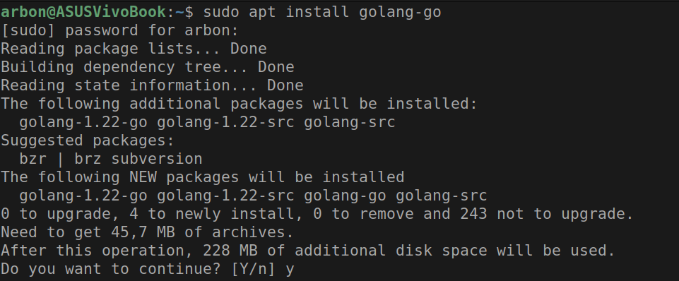
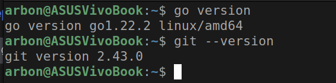
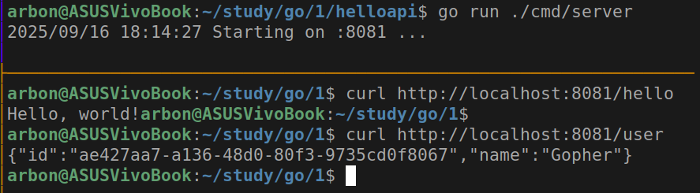
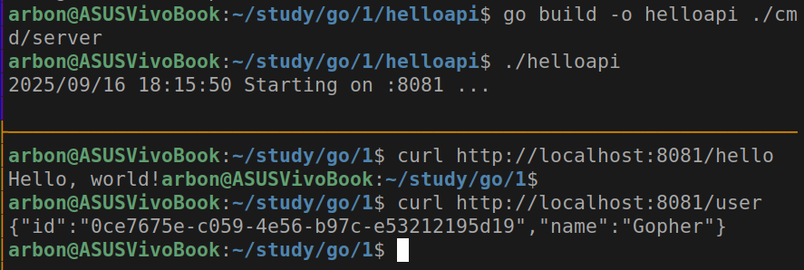
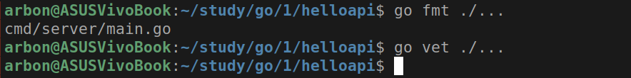
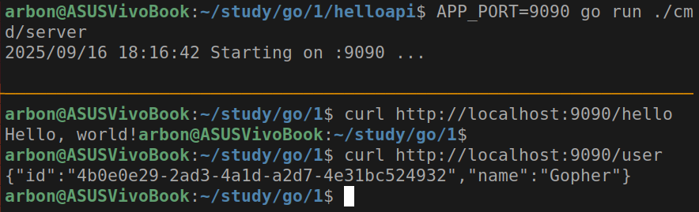
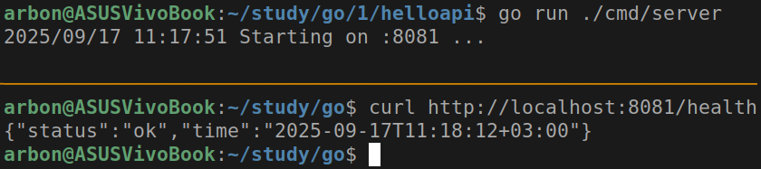

# Практическое задание 1

Студент группы *ЭФМО-02-25 Бондарь Андрей Ренатович*

## Описание

**Цель:** Развернуть рабочее окружение Go на Windows, создать минимальный HTTP-сервис на net/http, подключить и использовать внешнюю зависимость, собрать и проверить приложение.

**Задание:** Установить Go и Git, проверить версии. Инициализировать модуль Go в новом проекте. Реализовать HTTP-сервер с маршрутами /hello (текст) и /user (JSON). Подключить внешнюю библиотеку (генерация UUID) и использовать её в /user. Запустить и проверить ответы curl/браузером. Собрать бинарник .exe и подготовить README и отчёт.

## Установка Go и Git (если не установлены)

```bash
sudo apt update
sudo apt install golang-go git -y
```



## Проверка версий

```bash
go version
git --version
```



## Создание структуры проекта

```bash
mkdir -p ~/helloapi/cmd/server
cd ~/helloapi
```

## Инициализация модуля

```bash
go mod init example.com/helloapi
```

## Создание минимального HTTP-сервера

Создали файл cmd/server/main.go.

```go
import (
    "encoding/json"
    "fmt"
    "log"
    "net/http"
)
type user struct {
    ID   string `json:"id"`
    Name string `json:"name"`
}
func main() {
    mux := http.NewServeMux()
    // Текстовый ответ
    mux.HandleFunc("/hello", func(w http.ResponseWriter, r *http.Request) {
        fmt.Fprintln(w, "Hello, world!")
    })
    // Пока временный JSON (без UUID — добавим на шаге 4)
    mux.HandleFunc("/user", func(w http.ResponseWriter, r *http.Request) {
        w.Header().Set("Content-Type", "application/json")
        _ = json.NewEncoder(w).Encode(user{ID: "temp", Name: "Gopher"})
    })
    addr := ":8081"
    log.Printf("Starting on %s ...", addr)
    log.Fatal(http.ListenAndServe(addr, mux))
}
```

**Пояснения**:

- `http.NewServeMux()` - простой роутер из стандартной библиотеки.
- Для JSON всегда выставляем заголовок `Content-Type: application/json`.
- Используется порт 8081, так как стандартный 8080 был занят в системе.

## Установка зависимостей

Подтянем пакет для генерации UUID:

```bash
go get github.com/google/uuid@latest
go mod tidy
```

И заменим "temp" в cmd/server/main.go на реальный идентификатор.

```go
import "github.com/google/uuid"
// ...
mux.HandleFunc("/user", func(w http.ResponseWriter, r *http.Request) {
    w.Header().Set("Content-Type", "application/json")
    _ = json.NewEncoder(w).Encode(user{
        ID:   uuid.NewString(), // теперь реальный UUID
        Name: "Gopher",
    })
})
```

В корне проекта появился файл go.sum,
который фиксирует точные версии зависимостей.

## Запуск сервера

```bash
cd ~/helloapi
go run ./cmd/server
```

Проверка запущенного API (в другом терминале):

```bash
curl http://localhost:8081/hello
curl http://localhost:8081/user
```



## Сборка бинарника

```bash
go build -o helloapi ./cmd/server
./helloapi
```



Заметим, что ответы `curl` совпадают с предыдущим шагом.

## Проверка код-стайла

```bash
go fmt ./...
go vet ./...
```



## Настройка порта через переменные окружения

Обновим код сервера. Добавим:

```go
import (
    // ...
    "os"
)
func main() {
    port := os.Getenv("APP_PORT")
    if port == "" {
        port = "8081"
    }
    // ...
    addr := ":" + port
    log.Printf("Starting on %s ...", addr)
    log.Fatal(http.ListenAndServe(addr, mux))
}
```

Теперь можно запустить на другом порту, используюя переменную окружения:

```bash
APP_PORT=9090 go run ./cmd/server
```



## Добавление ручки `/health`

Добавим в код сервера:

```go
import (
    // ...
    "time"
)
func main() {
    // ...
    mux.HandleFunc("/health", func(w http.ResponseWriter, r *http.Request) {
        w.Header().Set("Content-Type", "application/json")
        json.NewEncoder(w).Encode(health{
            Status:    "ok",
            Time:    time.Now().Format(time.RFC3339),
        })
    })
}
```



## Остальное

Структура проекта:

```text
helloapi/
├── cmd/
│   └── server/
│       └── main.go
├── go.mod
└── go.sum
```

Все команды были протестированы на Ubuntu 22.04. Основные отличия от Windows:

1. Используются прямые слеши в путях
2. Бинарник создается без расширения .exe
3. Команды для переменных окружения отличаются (export APP_PORT=9090 вместо $env:APP_PORT="9090")
