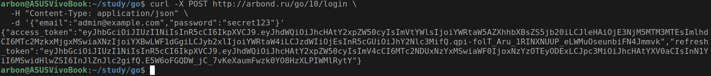
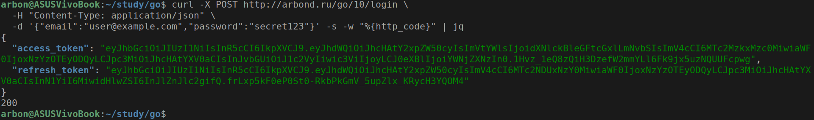
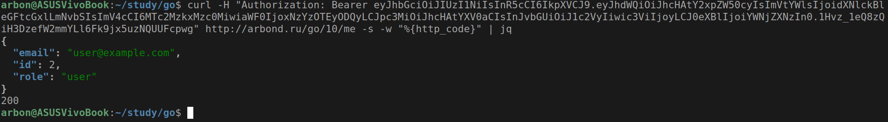
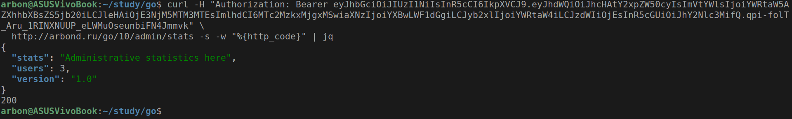
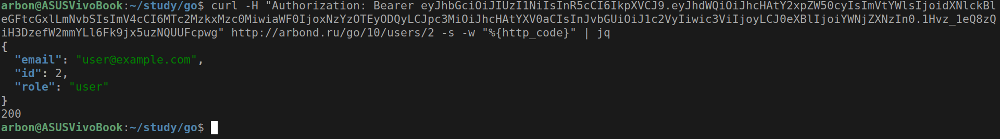
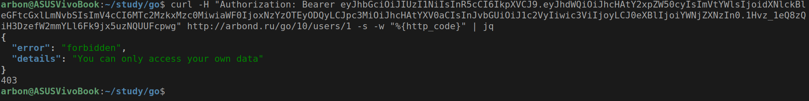
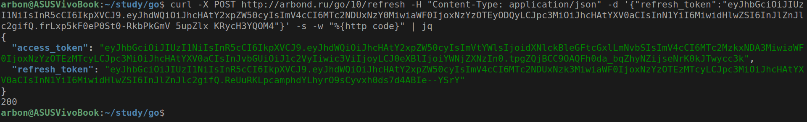
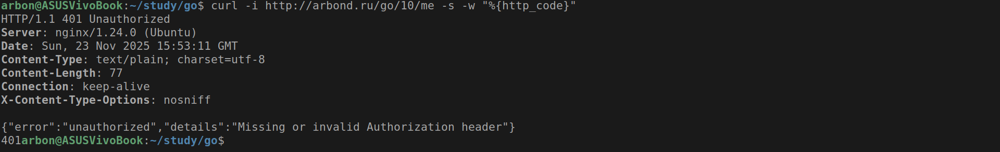
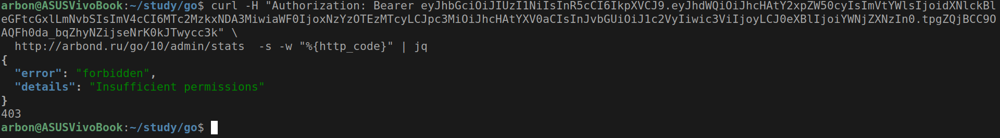

# Практическое задание 10. JWT-аутентификация: создание и проверка токенов. Middleware для авторизации

Студент группы *ЭФМО-02-25 Бондарь Андрей Ренатович*

## Описание

**Цели:**

- Понять устройство JWT и его применение в REST API
- Реализовать генерацию и проверку JWT токенов в Go (HS256)
- Создать middleware для аутентификации и авторизации (RBAC/ABAC)
- Реализовать механизм refresh токенов с blacklist
- Интегрировать систему аутентификации в HTTP-сервис
- Обеспечить работу через TCP порт и Unix сокеты

---

## Инициализация проекта

```bash
mkdir -p app/{cmd/{cli,server},internal/{http/middleware,core,repo,platform/{jwt,config}}}
cd app
go mod init app
go get github.com/go-chi/chi/v5
go get github.com/golang-jwt/jwt/v5
go get golang.org/x/crypto/bcrypt
```

---

## Структура проекта

```
app/
├── cmd/
│   ├── cli/
│   │   └── main.go                 # TCP порт версия
│   └── server/
│       └── main.go                 # Unix socket версия
├── go.mod
├── go.sum
└── internal/
    ├── http/
    │   ├── router.go               # Настройка маршрутов и middleware
    │   └── middleware/
    │       ├── authn.go            # Аутентификация JWT
    │       ├── authz.go            # RBAC авторизация
    │       └── abac.go             # ABAC правила доступа
    ├── core/
    │   ├── user.go                 # Доменные модели
    │   └── service.go              # Бизнес-логика и обработчики
    ├── repo/
    │   ├── user_mem.go             # In-memory хранилище пользователей
    │   └── blacklist_mem.go        # Blacklist refresh токенов
    └── platform/
        ├── jwt/
        │   └── jwt.go              # Генерация и валидация JWT
        └── config/
            └── config.go           # Конфигурация приложения
```

---

## Реализация

### Файл: `internal/platform/jwt/jwt.go`

Реализация JWT генерации и валидации с поддержкой access и refresh токенов.

**Ключевые компоненты:**

1. **Интерфейс Validator:**
   
   ```go
   type Validator interface {
    SignAccessToken(userID int64, email, role string) (string, error)
    SignRefreshToken(userID int64) (string, error)
    Parse(tokenStr string) (jwt.MapClaims, error)
   }
   ```
   
   Абстракция для работы с JWT, позволяющая легко тестировать и модифицировать реализацию.

2. **Реализация HS256:**
   
   ```go
   func (h *HS256) SignAccessToken(userID int64, email, role string) (string, error) {
    claims := jwt.MapClaims{
        "sub":   userID,
        "email": email,
        "role":  role,
        "iat":   now.Unix(),
        "exp":   now.Add(h.accessTokenTTL).Unix(),
        "type":  "access",  // Важно для различения типов токенов
    }
    return t.SignedString(h.secret)
   }
   ```
   
   Создает access токен с пользовательскими claims и временем жизни.

**Архитектурное значение:**

- Инкапсулирует всю JWT-специфичную логику
- Поддерживает разделение access и refresh токенов
- Обеспечивает безопасную подпись с использованием секретного ключа
- Валидирует issuer, audience и алгоритм подписи

### Файл: `internal/http/middleware/authn.go`

Middleware для аутентификации JWT токенов.

**Ключевые компоненты:**

1. **Извлечение токена:**
   
   ```go
   h := r.Header.Get("Authorization")
   if h == "" || !strings.HasPrefix(h, "Bearer ") {
    http.Error(w, `{"error":"unauthorized"}`, http.StatusUnauthorized)
    return
   }
   ```
   
   Проверяет наличие и формат заголовка Authorization.

2. **Валидация токена:**
   
   ```go
   claims, err := v.Parse(raw)
   if err != nil {
    http.Error(w, `{"error":"invalid_token"}`, http.StatusUnauthorized)
    return
   }
   ```
   
   Использует JWT валидатор для проверки подписи и срока действия.

3. **Добавление claims в контекст:**
   
   ```go
   ctx := context.WithValue(r.Context(), core.ClaimsKey, map[string]any(claims))
   next.ServeHTTP(w, r.WithContext(ctx))
   ```
   
   Передает аутентифицированные данные следующим обработчикам.

**Архитектурное значение:**

- Централизованная обработка аутентификации
- Изоляция JWT логики от бизнес-кода
- Единый формат ошибок аутентификации
- Подготовка контекста для авторизации

### Файл: `internal/http/middleware/authz.go`

RBAC middleware для проверки ролей пользователя.

**Ключевые компоненты:**

1. **Проверка ролей:**
   
   ```go
   func AuthZRoles(allowed ...string) func(http.Handler) http.Handler {
    set := make(map[string]struct{})
    for _, a := range allowed { set[a] = struct{}{} }
   
    return func(next http.Handler) http.Handler {
        return http.HandlerFunc(func(w http.ResponseWriter, r *http.Request) {
            claims, _ := r.Context().Value(core.ClaimsKey).(map[string]any)
            role, _ := claims["role"].(string)
   
            if _, ok := set[role]; !ok {
                http.Error(w, `{"error":"forbidden"}`, http.StatusForbidden)
                return
            }
            next.ServeHTTP(w, r)
        })
    }
   }
   ```
   
   Проверяет, что роль пользователя находится в списке разрешенных.

**Архитектурное значение:**

- Гибкая настройка прав доступа для разных маршрутов
- Четкое разделение аутентификации и авторизации
- Простота добавления новых ролей

### Файл: `internal/http/middleware/abac.go`

ABAC middleware для проверки прав доступа на основе атрибутов.

**Ключевые компоненты:**

1. **Проверка владения данными:**
   
   ```go
   // Админы могут всё
   if role == "admin" {
    next.ServeHTTP(w, r)
    return
   }
   ```

// Для пользователей проверяем, что они запрашивают свои данные
if userID != requestedID {
    http.Error(w, `{"error":"forbidden"}`, http.StatusForbidden)
    return
}

```
Реализует правило: пользователь может доступть только свои данные.

**Архитектурное значение:**
- Более гибкая модель авторизации чем RBAC
- Возможность реализации сложных бизнес-правил
- Комбинирование с RBAC для комплексной защиты

### Файл: `internal/core/service.go`

Бизнес-логика приложения и обработчики HTTP запросов.

**Ключевые компоненты:**

1. **Логин с выдачей токенов:**
```go
func (s *Service) LoginHandler(w http.ResponseWriter, r *http.Request) {
    u, err := s.repo.CheckPassword(in.Email, in.Password)
    accessToken, err := s.jwt.SignAccessToken(u.ID, u.Email, u.Role)
    refreshToken, err := s.jwt.SignRefreshToken(u.ID)

    jsonOK(w, TokenPair{
        AccessToken:  accessToken,
        RefreshToken: refreshToken,
    })
}
```

Аутентифицирует пользователя и выдает пару токенов.

2. **Обновление токенов:**
   
   ```go
   func (s *Service) RefreshHandler(w http.ResponseWriter, r *http.Request) {
    if s.blacklist.IsRevoked(in.RefreshToken) {
        httpError(w, 401, "token_revoked", "Refresh token has been revoked")
        return
    }
    // Добавляем старый токен в blacklist и выдаем новые
    s.blacklist.Add(in.RefreshToken, expiresAt)
   }
   ```
   
   Реализует безопасное обновление токенов с инвалидацией старых.

**Архитектурное значение:**

- Инкапсуляция бизнес-логики
- Обработка всех сценариев аутентификации
- Единый формат ответов и ошибок

---

## Документация API эндпоинтов

### Эндпоинт: [POST /login](http://arbond.ru/go/10/login)

Аутентификация пользователя и получение токенов.

**Тело запроса:**

```json
{
    "email": "user@example.com",
    "password": "secret123"
}
```

**Успешный ответ (200 OK):**

```json
{
    "access_token": "eyJhbGciOiJIUzI1NiIsInR5cCI6IkpXVCJ9...",
    "refresh_token": "eyJhbGciOiJIUzI1NiIsInR5cCI6IkpXVCJ9..."
}
```

**Ошибки:**

- `400 Bad Request` - неверный формат запроса
- `401 Unauthorized` - неверные учетные данные

### Эндпоинт: [POST /refresh](http://arbond.ru/go/10/refresh)

Обновление пары токенов.

**Тело запроса:**

```json
{
    "refresh_token": "eyJhbGciOiJIUzI1NiIsInR5cCI6IkpXVCJ9..."
}
```

**Успешный ответ (200 OK):**

```json
{
    "access_token": "новый_access_token",
    "refresh_token": "новый_refresh_token"
}
```

**Ошибки:**

- `400 Bad Request` - отсутствует refresh_token
- `401 Unauthorized` - невалидный или отозванный токен

### Эндпоинт: [GET /me](http://arbond.ru/go/10/me)

Получение профиля текущего пользователя.

**Заголовки:**

```
Authorization: Bearer <access_token>
```

**Успешный ответ (200 OK):**

```json
{
    "id": 1,
    "email": "admin@example.com",
    "role": "admin"
}
```

**Ошибки:**

- `401 Unauthorized` - отсутствует или невалидный токен

### Эндпоинт: [GET /users/{id}](http://arbond.ru/go/10/users/2)

Получение данных пользователя (с ABAC защитой).

**Успешный ответ (200 OK):**

```json
{
    "id": 2,
    "email": "user@example.com", 
    "role": "user"
}
```

**Ошибки:**

- `403 Forbidden` - попытка доступа к чужим данным (для роли user)
- `404 Not Found` - пользователь не существует

### Эндпоинт: [GET /admin/stats](http://arbond.ru/go/10/admin/stats)

Получение статистики (только для администраторов).

**Успешный ответ (200 OK):**

```json
{
    "users": 3,
    "version": "1.0",
    "stats": "Administrative statistics here"
}
```

**Ошибки:**

- `403 Forbidden` - недостаточно прав (для роли user)

### Эндпоинт: [GET /admin/users/{id}](http://arbond.ru/go/10/admin/users/1)

Получение данных любого пользователя (только для администраторов).

---

## Тестирование

### Тестирование через публичные эндпоинты

#### Логин администратора

```bash
curl -X POST http://arbond.ru/go/10/login \
  -H "Content-Type: application/json" \
  -d '{"email":"admin@example.com","password":"secret123"}'
```



#### Логин обычного пользователя

```bash
curl -X POST http://arbond.ru/go/10/login \
  -H "Content-Type: application/json" \
  -d '{"email":"user@example.com","password":"secret123"}'
```



#### Получение профиля

```bash
curl -H "Authorization: Bearer ACCESS_TOKEN" \
  http://arbond.ru/go/10/me
```



#### Доступ к админской статистике

```bash
curl -H "Authorization: Bearer ADMIN_TOKEN" \
  http://arbond.ru/go/10/admin/stats
```



#### Тестирование ABAC правил

user пытается получить свои данные:
```bash
curl -H "Authorization: Bearer USER_TOKEN" \
  http://arbond.ru/go/10/users/2
```



user пытается получить чужие данные:
```bash
curl -H "Authorization: Bearer USER_TOKEN" \
  http://arbond.ru/go/10/users/1
```


#### Обновление токенов

```bash
curl -X POST http://arbond.ru/go/10/refresh \
  -H "Content-Type: application/json" \
  -d '{"refresh_token":"REFRESH_TOKEN"}'
```



### Тестирование безопасности

#### Попытка доступа без токена

```bash
curl -i http://arbond.ru/go/10/me
```



#### Попытка доступа с неверной ролью

```bash
curl -H "Authorization: Bearer USER_TOKEN" \
  http://arbond.ru/go/10/admin/stats
```



---

## Заключение

В ходе практической работы успешно реализована полноценная
система JWT-аутентификации и авторизации на Go.

- **Полноценная JWT-аутентификация** с access (15 мин) и refresh (7 дней) токенами
- **Middleware архитектура** с четким разделением AuthN и AuthZ
- **RBAC модель** для управления правами доступа на основе ролей
- **ABAC правила** для контроля доступа к данным на основе атрибутов
- **Refresh механика** с blacklist для безопасного обновления токенов
- **Двойная реализация** - CLI (TCP порт) и Server (Unix socket) версии
- **Единый формат ошибок** для согласованного API
