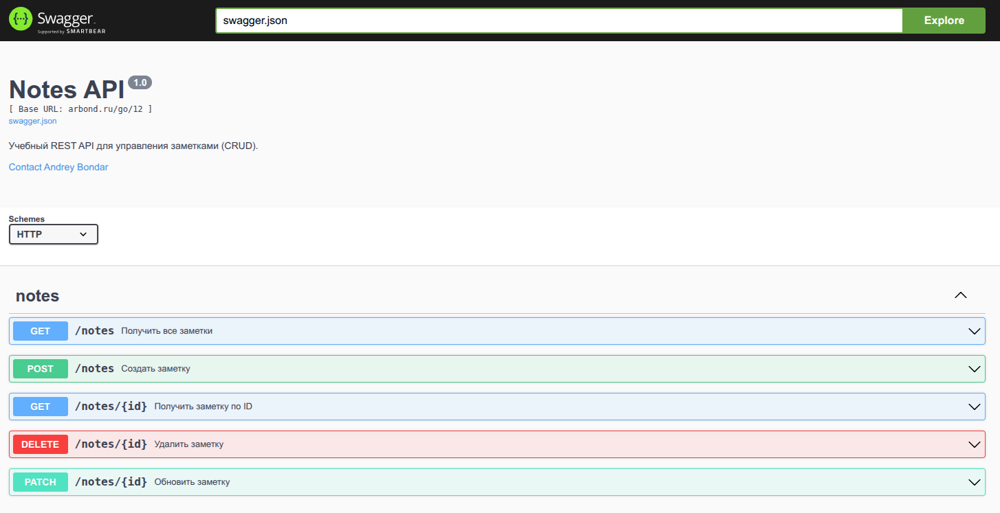

# Практическое задание 12. Подключение Swagger/OpenAPI

Студент группы *ЭФМО-02-25 Бондарь Андрей Ренатович*

## Описание

**Цели:**
- Освоить основы спецификации OpenAPI (Swagger) для REST API.
- Подключить автогенерацию документации к проекту app.
- Научиться публиковать интерактивную документацию на эндпоинте GET /docs.
- Синхронизировать код и спецификацию через комментарии-аннотации.
- Подготовить процесс обновления документации.

---

## Инициализация проекта

```bash
cd app
go get github.com/swaggo/http-swagger
go get github.com/swaggo/swag
go install github.com/swaggo/swag/cmd/swag@latest
```

---

## Структура проекта

```
app
├── cmd
│   ├── api
│   │   └── main.go
│   └── server
│       └── main.go
├── docs
│   ├── docs.go
│   ├── swagger.json
│   └── swagger.yaml
├── go.mod
├── go.sum
└── internal
    ├── core
    │   └── note.go
    ├── http
    │   ├── handlers
    │   │   └── notes.go
    │   └── router.go
    ├── platform
    │   └── config
    │       └── config.go
    └── repo
        └── note_mem.go
```

---

## Реализация

В этом разделе описывается реализация ключевых компонентов Swagger документации
с объяснением назначения каждого изменения и его роли в системе.

### Файл: `cmd/api/main.go`

Точка входа приложения с Swagger аннотациями верхнего уровня.

**Ключевые компоненты:**

1. **Аннотации пакета:**
```go
// Package main Notes API server.
//
// @title Notes API
// @version 1.0
// @description Учебный REST API для управления заметками (CRUD).
// @contact.name Backend Course
// @contact.email example@university.ru
// @BasePath /
// @schemes http
package main
```
Определяет метаинформацию API для генерации документации.

2. **Подключение Swagger UI:**
```go
import httpSwagger "github.com/swaggo/http-swagger"

// В функции main():
router.Get("/docs/*", httpSwagger.WrapHandler)
```
Добавляет маршрут для интерактивной документации.

**Архитектурное значение:**
- Централизованная конфигурация метаданных API
- Автоматическое предоставление документации через веб-интерфейс
- Стандартизированное описание API для клиентов

### Файл: `internal/core/note.go`

Расширение моделей данных Swagger аннотациями.

**Ключевые компоненты:**

1. **DTO структуры с примерами:**
```go
// NoteCreate represents data for creating a new note
type NoteCreate struct {
    Title   string `json:"title" example:"Новая заметка"`
    Content string `json:"content" example:"Текст заметки"`
}

// NoteUpdate represents data for updating an existing note
type NoteUpdate struct {
    Title   *string `json:"title,omitempty" example:"Обновленный заголовок"`
    Content *string `json:"content,omitempty" example:"Новый текст"`
}
```
Предоставляет примеры данных для Swagger UI.

**Архитектурное значение:**
- Стандартизирует форматы запросов и ответов
- Предоставляет примеры для тестирования в документации
- Отделяет DTO от доменных моделей

### Файл: `internal/http/handlers/notes.go`

Добавление аннотаций к обработчикам HTTP запросов.

**Ключевые компоненты:**

1. **Аннотация создания заметки:**
```go
// CreateNote godoc
// @Summary Создать заметку
// @Description Создает новую заметку
// @Tags notes
// @Accept json
// @Produce json
// @Param input body core.NoteCreate true "Данные новой заметки"
// @Success 201 {object} core.Note
// @Failure 400 {object} map[string]string
// @Failure 500 {object} map[string]string
// @Router /notes [post]
func (h *Handler) CreateNote(w http.ResponseWriter, r *http.Request) {
```

2. **Аннотация получения всех заметок:**
```go
// GetAllNotes godoc
// @Summary Получить все заметки
// @Description Возвращает список всех заметок
// @Tags notes
// @Produce json
// @Success 200 {array} core.Note
// @Failure 500 {object} map[string]string
// @Router /notes [get]
func (h *Handler) GetAllNotes(w http.ResponseWriter, r *http.Request) {
```

**Архитектурное значение:**
- Документирует поведение API на уровне кода
- Обеспечивает автоматическую синхронизацию документации
- Предоставляет информацию о кодах ответов и типах данных

### Файл: `internal/http/router.go`

Оптимизация структуры маршрутов для совместимости со Swagger.

**Ключевые компоненты:**

```go
func NewRouter(h *handlers.Handler) *chi.Mux {
    r := chi.NewRouter()

    r.Route("/notes", func(r chi.Router) {
        r.Post("/", h.CreateNote)
        r.Get("/", h.GetAllNotes)
        r.Get("/{id}", h.GetNote)
        r.Patch("/{id}", h.UpdateNote)
        r.Delete("/{id}", h.DeleteNote)
    })

    return r
}
```

**Архитектурное значение:**
- Обеспечивает согласованность между аннотациями и фактическими маршрутами
- Упрощает группировку связанных эндпоинтов в документации
- Подготавливает структуру для будущего расширения API

---

## Документация API эндпоинтов

### Swagger UI: [GET /docs](http://arbond.ru/go/12/docs/index.html)

Интерактивная документация API.

**Полный URL:** `http://arbond.ru/go/12/docs/index.html`

**Функциональность:**
- Просмотр всех доступных эндпоинтов
- Интерактивное тестирование API
- Автогенерация клиентского кода
- Валидация запросов и ответов



### Эндпоинт: [POST /login](http://arbond.ru/go/12/notes)

Создание новой заметки.

**Документация в Swagger:**
- Описание: "Создает новую заметку"
- Тело запроса: JSON объект NoteCreate
- Успешный ответ: 201 Created с объектом Note
- Ошибки: 400, 500

### Эндпоинт: [GET /notes](http://arbond.ru/go/11/notes)

Получение списка всех заметок.

**Документация в Swagger:**
- Описание: "Возвращает список всех заметок"
- Успешный ответ: 200 OK с массивом Note
- Ошибки: 500

### Эндпоинт: [GET /notes/{id}](http://arbond.ru/go/11/notes/{id})

Получение заметки по ID.

**Документация в Swagger:**
- Описание: "Возвращает заметку по указанному идентификатору"
- Параметры пути: id (integer, required)
- Успешный ответ: 200 OK с объектом Note
- Ошибки: 400, 404, 500

### Эндпоинт: [PATCH /notes/{id}](http://arbond.ru/go/11/notes/{id})

Обновление существующей заметки.

**Документация в Swagger:**
- Описание: "Обновляет существующую заметку (частичное обновление)"
- Параметры пути: id (integer, required)
- Тело запроса: JSON объект NoteUpdate
- Успешный ответ: 200 OK с объектом Note
- Ошибки: 400, 404, 500

### Эндпоинт: [DELETE /notes/{id}](http://arbond.ru/go/11/notes/{id})

Удаление заметки.

**Документация в Swagger:**
- Описание: "Удаляет заметку по указанному идентификатору"
- Параметры пути: id (integer, required)
- Успешный ответ: 204 No Content
- Ошибки: 400, 404, 500

---

## Запуск и генерация документации

### Генерация документации

```bash
# Способ 1: Через установленный swag
swag init -g cmd/api/main.go -o docs

# Способ 2: Через go run (без установки)
go run github.com/swaggo/swag/cmd/swag@latest init -g cmd/api/main.go -o docs

# Способ 3: Через Makefile
make swagger
```

### Запуск приложения

```bash
# Запуск с предварительной генерацией документации
make all

# Или по отдельности
make swagger
make run
```

### Проверка работы

```bash
# Сервер запускается на порту 8080
curl http://arbond.ru/go/12/notes

# Документация доступна по адресу
open http://arbond.ru/go/12/docs/index.html
```

---

## Заключение

В ходе практической работы успешно реализована автоматическая генерация документации для REST API проекта app.
Приложение предоставляет интерактивную документацию Swagger UI на эндпоинте `/docs` с полным описанием всех CRUD операций:

- **http://arbond.ru/go/12/docs** - интерактивная документация API
- **Автоматическая генерация** из аннотаций в коде
- **Полное описание** всех эндпоинтов и моделей данных
- **Интерактивное тестирование** без внешних инструментов
