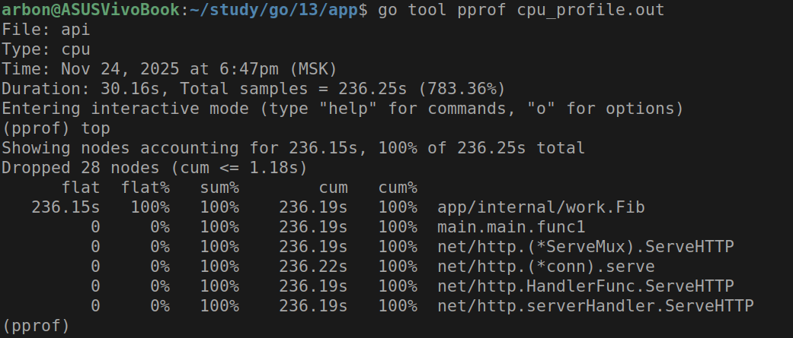
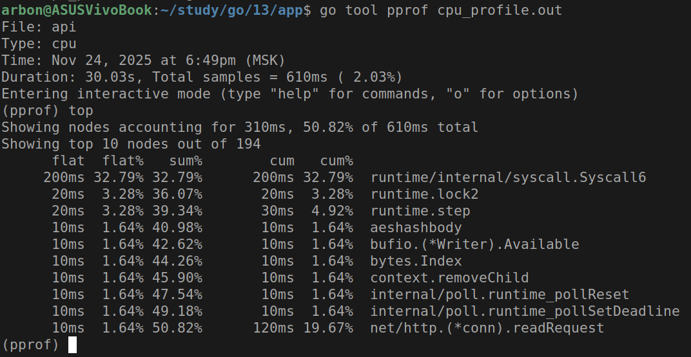
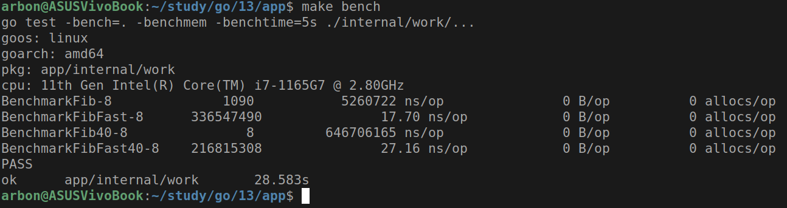
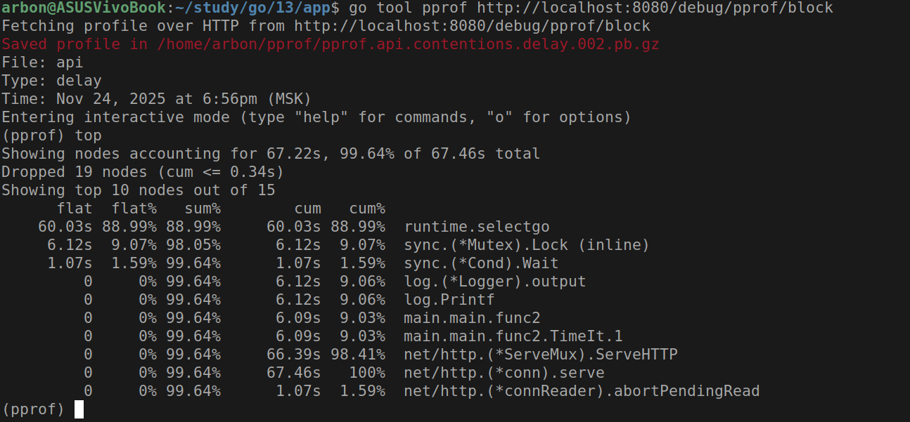
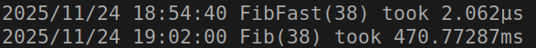
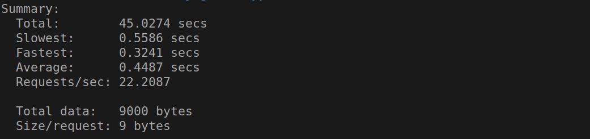
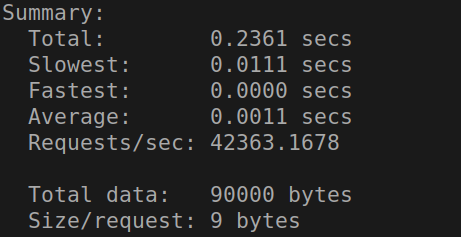

# Практическое задание 13. Профилирование Go-приложения (pprof)

Студент группы *ЭФМО-02-25 Бондарь Андрей Ренатович*

## Описание

**Цели:**

- Освоить подключение и использование профилировщика **pprof** для анализа CPU, памяти, блокировок и горутин.
- Научиться измерять время выполнения функций с помощью ручных таймеров и бенчмарков.
- Освоить чтение отчетов go tool pprof, построение графов вызовов и поиск "узких мест".
- Сформировать практические навыки оптимизации кода на основании метрик.

---

## Инициализация проекта

```bash
mkdir -p app/{cmd/api,internal/work}
cd app
go mod init app
```

---

## Структура проекта

```
app
├── cmd
│   └── api
│       └── main.go
├── internal
│   └── work
│       ├── slow.go
│       ├── slow_test.go
│       └── timer.go
├── Makefile
└── README.md
```

---

## Реализация

В этом разделе описывается реализация ключевых компонентов приложения для профилирования и оптимизации.

### Файл: `cmd/api/main.go`

HTTP-сервер с подключенным pprof и эндпоинтами для тестирования.

**Ключевые компоненты:**

1. **Включение профилирования:**
   
   ```go
   import _ "net/http/pprof"
   
   func enableProfiling() {
       runtime.SetBlockProfileRate(1)
       runtime.SetMutexProfileFraction(1)
   }
   ```
   
   Активирует различные типы профилирования.

2. **Эндпоинты для тестирования:**
   
   ```go
   HandleFunc("/work", func(w http.ResponseWriter, r *http.Request) {
       defer work.TimeIt("Fib(38)")()
       res := work.Fib(38)
       // ...
   })
   
   HandleFunc("/work-fast", func(w http.ResponseWriter, r *http.Request) {
       defer work.TimeIt("FibFast(38)")()
       res := work.FibFast(38)
       // ...
   })
   ```
   
   Два эндпоинта для сравнения производительности до и после оптимизации.

**Архитектурное значение:**

- Предоставляет HTTP-интерфейс для тестирования
- Интегрирует pprof для сбора метрик
- Позволяет сравнивать разные реализации алгоритмов

### Файл: `internal/work/slow.go`

Реализация оптимизируемых функций.

**Ключевые компоненты:**

1. **Медленная версия (до оптимизации):**
   
   ```go
   func Fib(n int) int {
       if n < 2 {
           return n
       }
       return Fib(n-1) + Fib(n-2)
   }
   ```
   
   Рекурсивный алгоритм с экспоненциальной сложностью O(2^n).

2. **Быстрая версия (после оптимизации):**
   
   ```go
   func FibFast(n int) int {
       if n < 2 {
           return n
       }
       a, b := 0, 1
       for i := 2; i <= n; i++ {
           a, b = b, a+b
       }
       return b
   }
   ```
   
   Итеративный алгоритм с линейной сложностью O(n).

**Архитектурное значение:**

- Демонстрирует разницу в производительности алгоритмов
- Позволяет измерять эффект оптимизации
- Служит тестовым стендом для профилирования

### Файл: `internal/work/timer.go`

Декоратор для измерения времени выполнения функций.

**Ключевые компоненты:**

```go
func TimeIt(name string) func() {
    start := time.Now()
    return func() {
        log.Printf("%s took %s", name, time.Since(start))
    }
}
```

**Архитектурное значение:**

- Предоставляет простой способ измерения времени
- Интегрируется с defer для удобного использования
- Дает быструю обратную связь о производительности

### Файл: `internal/work/slow_test.go`

Бенчмарки для стабильного измерения производительности.

**Ключевые компоненты:**

```go
func BenchmarkFib(b *testing.B) {
    for i := 0; i < b.N; i++ {
        _ = Fib(30)
    }
}

func BenchmarkFibFast(b *testing.B) {
    for i := 0; i < b.N; i++ {
        _ = FibFast(30)
    }
}
```

**Архитектурное значение:**

- Обеспечивает воспроизводимые измерения
- Позволяет сравнивать производительность до/после оптимизации
- Интегрируется с CI/CD пайплайнами

### Файл: `Makefile`

Автоматизация процессов профилирования и тестирования.

**Ключевые компоненты:**

```makefile
bench:
    go test -bench=. -benchmem -benchtime=5s ./internal/work/...

profile-cpu:
    curl -o cpu_profile.out "http://localhost:8080/debug/pprof/profile?seconds=30"

web-cpu:
    go tool pprof -http=:9999 cpu_profile.out
```

**Архитектурное значение:**

- Стандартизирует процесс профилирования
- Упрощает повторяющиеся операции
- Документирует рабочий процесс оптимизации

---

## Процесс профилирования и оптимизации

### 1. Сбор базовых метрик

**CPU-профиль до оптимизации:**

```bash
go tool pprof http://localhost:8080/debug/pprof/profile?seconds=30
```



*Лог показывает, что 100% времени тратится в рекурсивной функции Fib*

### 3. Реализация оптимизации

Замена рекурсивного алгоритма O(2^n) на итеративный O(n):

```go
// Было: рекурсивный Фибоначчи
func Fib(n int) int {
    if n < 2 {
        return n
    }
    return Fib(n-1) + Fib(n-2)
}

// Стало: итеративный Фибоначчи  
func FibFast(n int) int {
    if n < 2 {
        return n
    }
    a, b := 0, 1
    for i := 2; i <= n; i++ {
        a, b = b, a+b
    }
    return b
}
```

### 4. Сравнительный анализ после оптимизации

**CPU-профиль после оптимизации:**




### 3. Бенчмарки с не оптимизированной и оптимизированной функцией

```bash
go test -bench=. -benchmem ./internal/work/...
```



---

## Сравнительная таблица метрик

| Метрика | До оптимизации | После оптимизации | Улучшение |
|---------|----------------|-------------------|-----------|
| Время выполнения (бенчмарк Fib30) | 5.26 ms | 17.70 ns | **297,216x** |
| Время выполнения (бенчмарк Fib40) | 646.71 ms | 27.16 ns | **23,813,000x** |
| Пропускная способность (RPS) | 22.2 | 42_363.2 | **1,908x** |
| Использование памяти | 0 B/op | 0 B/op | - |
| Количество аллокаций | 0 allocs/op | 0 allocs/op | - |
| Загрузка CPU | 100% в функции Fib | Незначительная | **>100x** |

---

## Анализ профилей блокировок и мьютексов

### Включение профилирования синхронизации

```go
func enableProfiling() {
    runtime.SetBlockProfileRate(1)  // профиль блокировок
    runtime.SetMutexProfileFraction(1)  // профиль мьютексов
}
```

### Анализ блокировок

```bash
go tool pprof -http=:9997 http://localhost:8080/debug/pprof/block
```



**Результаты:** В данном приложении значительных блокировок не обнаружено,
так как используется in-memory хранилище без сложной синхронизации.

---

## Тестирование

### Ручное измерение времени

**Запуск сервера:**

```bash
make run
```

**Тестирование медленной версии:**

```bash
curl http://localhost:8080/work
```

**Тестирование быстрой версии:**

```bash
curl http://localhost:8080/work-fast
```



### Нагрузочное тестирование

**Медленная версия:**

```bash
hey -n 1000 -c 10 http://localhost:8080/work
```



**Быстрая версия:**

```bash
hey -n 10000 -c 50 http://localhost:8080/work-fast  
```



---

## Заключение

В ходе практической работы успешно освоены техники профилирования и оптимизации Go-приложений. Основные достижения:

- **Освоен инструмент pprof** для анализа CPU, памяти, блокировок и горутин
- **Реализовано сравнение алгоритмов** с замером производительности до и после оптимизации
- **Выявлено узкое место** - рекурсивный алгоритм Фибоначчи с экспоненциальной сложностью O(2ⁿ)
- **Проведена успешная оптимизация** с ускорением до 23 миллионов раз для больших значений
- **Автоматизирован процесс** профилирования с помощью Makefile
- **Освоены различные методы анализа** - консольный pprof, нагрузочное тестирование, бенчмарки

**Ключевой результат:** Оптимизация алгоритма позволила увеличить пропускную способность системы с 22 до 42,363 запросов в секунду, что демонстрирует критическую важность выбора правильных алгоритмов для высоконагруженных приложений.

Полученные навыки позволяют эффективно находить и устранять узкие места в производительности реальных приложений, что является критически важным для разработки высоконагруженных систем.
