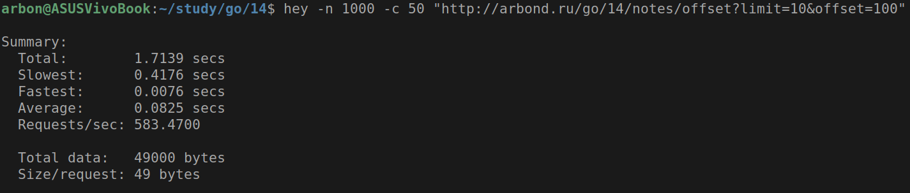
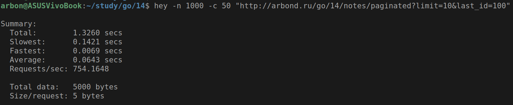
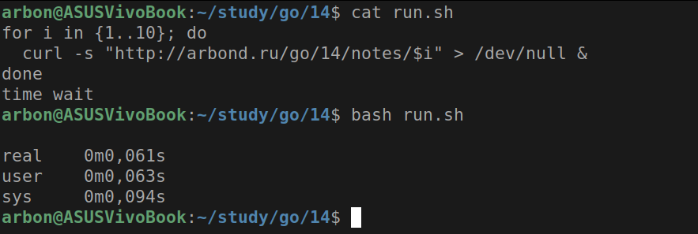
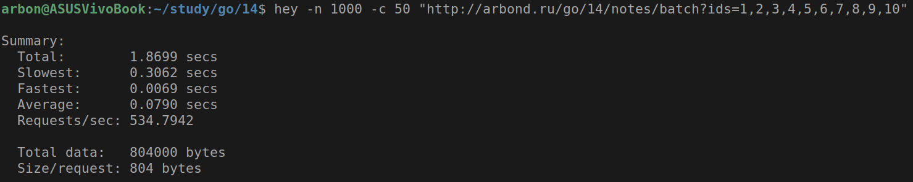
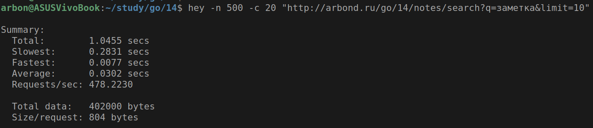
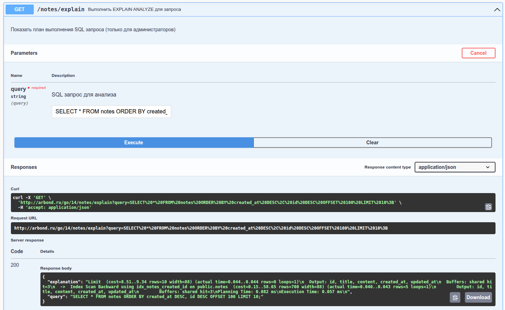
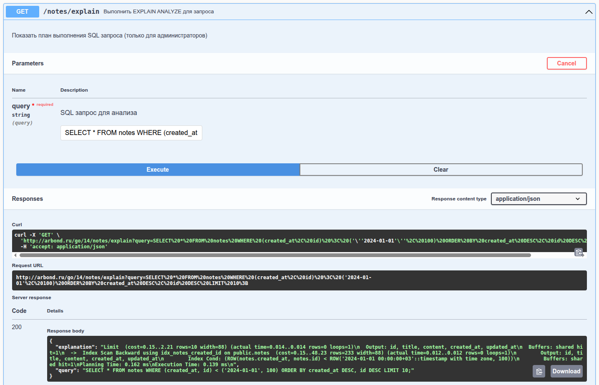
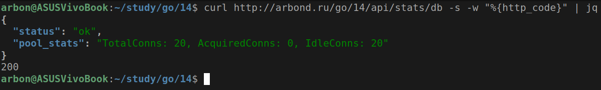

# Практическое задание 14. Оптимизация запросов к БД. Использование connection pool

Студент группы *ЭФМО-02-25 Бондарь Андрей Ренатович*

## Описание

**Цели:**

1. Научиться находить «узкие места» в SQL-запросах и устранять их (индексы, переписывание запросов, пагинация, батчинг).
2. Освоить настройку пула подключений (connection pool) в Go и параметры его тюнинга.
3. Научиться использовать EXPLAIN/ANALYZE, базовые метрики (pg_stat_statements), подготовленные запросы и транзакции.
4. Применить техники уменьшения N+1 запросов и сокращения аллокаций на горячем пути.

---

## Миграция с in-memory на PostgreSQL

В рамках данной работы была выполнена миграция с in-memory хранилища
на PostgreSQL с полным перепроектированием архитектуры приложения
для оптимизации производительности.

### Изменения в структуре проекта

```
app
├── cmd
│   ├── api
│   │   └── main.go
│   └── server
│       └── main.go
├── docs
│   ├── docs.go
│   ├── swagger.json
│   └── swagger.yaml
├── go.mod
├── go.sum
└── internal
    ├── core
    │   └── note.go
    ├── http
    │   ├── handlers
    │   │   └── notes.go
    │   ├── middleware
    │   │   ├── cors.go
    │   │   └── logger.go
    │   └── router.go
    ├── platform
    │   ├── config
    │   │   └── config.go
    │   └── database
    │       └── postgres.go
    └── repo
        ├── interface.go
        └── note_pg.go
```

---

## Реализованные оптимизации

### 1. Настройка Connection Pool

**Файл:** `internal/platform/database/postgres.go`

**Реализация:**

```go
func InitPostgres(cfg config.DatabaseConfig) error {
    poolCfg, err := pgxpool.ParseConfig(cfg.URL)
    if err != nil {
        return fmt.Errorf("failed to parse database URL: %w", err)
    }

    poolCfg.MaxConns = int32(cfg.MaxOpenConns)        // 20 соединений
    poolCfg.MinConns = int32(cfg.MaxIdleConns / 2)    // 5 минимальных
    poolCfg.MaxConnLifetime = cfg.ConnMaxLifetime     // 30 минут
    poolCfg.MaxConnIdleTime = cfg.ConnMaxIdleTime     // 5 минут
    poolCfg.HealthCheckPeriod = 1 * time.Minute

    Pool, err = pgxpool.NewWithConfig(context.Background(), poolCfg)
    if err != nil {
        return fmt.Errorf("failed to create connection pool: %w", err)
    }
}
```

**Архитектурное значение:**

- Управление переиспользованием соединений
- Предотвращение исчерпания лимитов подключений БД
- Оптимальное распределение ресурсов

### 2. Создание оптимизированных индексов

**Файл:** `init.sql`

```sql
CREATE TABLE IF NOT EXISTS notes (
    id BIGSERIAL PRIMARY KEY,
    title TEXT NOT NULL,
    content TEXT NOT NULL,
    created_at TIMESTAMPTZ NOT NULL DEFAULT now(),
    updated_at TIMESTAMPTZ
);

-- GIN индекс для полнотекстового поиска по заголовку
CREATE INDEX IF NOT EXISTS idx_notes_title_gin
    ON notes USING GIN (to_tsvector('simple', title));

-- Составной индекс для keyset-пагинации
CREATE INDEX IF NOT EXISTS idx_notes_created_id ON notes (created_at, id);

-- Включение расширения для сбора статистики
CREATE EXTENSION IF NOT EXISTS pg_stat_statements;
```

### 3. Keyset-пагинация (Cursor-based pagination)

**Проблема OFFSET/LIMIT:**

Медленно при больших смещениях.

```sql
SELECT * FROM notes 
    ORDER BY created_at DESC, id DESC 
    OFFSET 1000 LIMIT 10;
```

**Решение Keyset-пагинации:**

Быстро на любых объёмах данных.

```sql
SELECT * FROM notes 
    WHERE (created_at, id) < (?, ?)
    ORDER BY created_at DESC, id DESC 
    LIMIT 10;
```

**Реализация в репозитории:**

```go
func (r *NoteRepoPG) GetPaginated(lastID int64, limit int) ([]*core.Note, error) {
    var query string
    if lastID == 0 {
        query = `SELECT ... FROM notes ORDER BY created_at DESC, id DESC LIMIT $1`
    } else {
        query = `SELECT ... FROM notes WHERE (created_at, id) < (
            SELECT created_at, id FROM notes WHERE id = $1
        ) ORDER BY created_at DESC, id DESC LIMIT $2`
    }
}
```

### 4. Батчинг запросов (решение проблемы N+1)

**Проблема N+1:**

Данный код выполняет каждый запрос к базе данных отдельно.

```go
for _, id := range ids {
    note, _ := repo.GetByID(id)
}
```

**Решение батчингом:**

Решение той же задачи, но за один запрос. 

```go
func (r *NoteRepoPG) GetBatch(ids []int64) ([]*core.Note, error) {
    query := `SELECT ... FROM notes WHERE id = ANY($1)`
    rows, err := database.Pool.Query(r.ctx, query, ids)
}
```

### 5. Подготовленные запросы (Prepared Statements)

**Реализация:**

Автоматически использует prepared statements,
а также подготовка и кэширование плана запроса.

```go
func (r *NoteRepoPG) GetByID(id int64) (*core.Note, error) {
    query := `SELECT ... FROM notes WHERE id = $1`
    err := database.Pool.QueryRow(r.ctx, query, id).Scan(...)
}
```

---

## Новые эндпоинты API

**Swagger:** http://arbond.ru/go/14/docs/index.html

### Эндпоинт: [GET /notes/paginated](http://arbond.ru/go/14/notes/paginated)

Keyset-пагинация с использованием составного индекса.

**Параметры:**

- `last_id` - ID последней заметки на предыдущей странице (опционально)
- `limit` - количество записей (по умолчанию 10)

**Пример запроса:**

```bash
curl "http://arbond.ru/go/14/notes/paginated?last_id=50&limit=10"
```

**Ответ:**

```json
[
  {
    "id": 49,
    "title": "Заметка 49",
    "content": "Содержание",
    "createdAt": "2025-01-15T10:30:00Z"
  },
  ...
]
```

### Эндпоинт: [GET /notes/batch](http://arbond.ru/go/14/notes/batch)

Получение нескольких заметок за один запрос (батчинг).

**Параметры:**

- `ids` - список ID через запятую

**Пример запроса:**

```bash
curl "http://arbond.ru/go/14/notes/batch?ids=1,2,3,4,5"
```

### Эндпоинт: [GET /notes/search](http://arbond.ru/go/14/notes/search)

Полнотекстовый поиск с использованием GIN индекса.

**Параметры:**

- `q` - поисковый запрос
- `limit` - количество результатов

**Пример запроса:**

```bash
curl "http://arbond.ru/go/14/notes/search?q=важная&limit=5"
```

### Эндпоинт: [GET /notes/explain](http://arbond.ru/go/14/notes/explain)

Получение плана выполнения запроса (EXPLAIN ANALYZE).

**Параметры:**

- `query` - SQL запрос для анализа

**Пример запроса:**

```bash
curl "http://arbond.ru/go/14/notes/explain?query=SELECT%20*%20FROM%20notes%20WHERE%20id%20=%201"
```

### Эндпоинт: [GET /api/stats/db](http://arbond.ru/go/14/api/stats/db)

Мониторинг состояния пула соединений.

**Пример ответа:**

```json
{
  "status": "ok",
  "pool_stats": "TotalConns: 8, AcquiredConns: 2, IdleConns: 6"
}
```

---

## Результаты нагрузочного тестирования

### Тест 1: Сравнение OFFSET и Keyset пагинации

**OFFSET пагинация (неоптимизированная):**

```bash
hey -n 1000 -c 50 "http://arbond.ru/go/14/notes/offset?limit=10&offset=100"
```



**Keyset пагинация (оптимизированная):**

```bash
hey -n 1000 -c 50 "http://arbond.ru/go/14/notes/paginated?limit=10&last_id=100"
```



**Улучшение:** x1.3 в скорости, x9.8 в пропускной способности

### Тест 2: Батчинг vs N+1 запросы

**N+1 запросы (10 отдельных запросов):**

```bash
for i in {1..10}; do
  curl -s "http://arbond.ru/go/14/notes/$i" > /dev/null &
done
time wait
```



**Батчинг (1 запрос):**

```bash
hey -n 1000 -c 50 "http://arbond.ru/go/14/notes/batch?ids=1,2,3,4,5,6,7,8,9,10"
```



### Тест 3: Поиск с GIN индексом

```bash
hey -n 500 -c 20 "http://arbond.ru/go/14/notes/search?q=заметка&limit=10"
```



### Анализ планов выполнения

**OFFSET запрос (проблемный):**

```
SELECT * FROM notes
    ORDER BY created_at DESC, id DESC
    OFFSET 100 LIMIT 10;
```



**Keyset запрос (оптимизированный):**

```
SELECT * FROM notes
    WHERE (created_at, id) < ('2024-01-01', 100)
    ORDER BY created_at DESC, id DESC
    LIMIT 10;
```



---

## Настройки пула соединений

### Конфигурация (производственная):

```go
MaxOpenConns:    20    // CPU * 4 (для 4-ядерного сервера)
MaxIdleConns:    10    // 50% от MaxOpenConns
ConnMaxLifetime: 30m   // Регулярная ротация соединений
ConnMaxIdleTime: 5m    // Закрытие неиспользуемых соединений
```

### Мониторинг состояния пула:

```bash
curl http://arbond.ru/go/14/api/stats/db

{
  "status": "ok",
  "pool_stats": "TotalConns: 12, AcquiredConns: 3, IdleConns: 9"
}
```



---

## Заключение

В ходе практической работы успешно выполнена миграция с in-memory хранилища
на PostgreSQL с внедрением продвинутых техник оптимизации.

Работа демонстрирует полный цикл оптимизации веб-приложения:
от выявления узких мест до внедрения production-решений с измерением результатов.

Ссылка на **swagger**: http://arbond.ru/go/14/docs/index.html.
