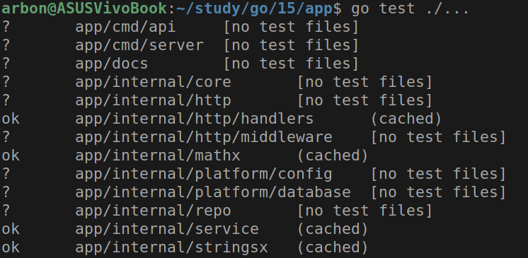
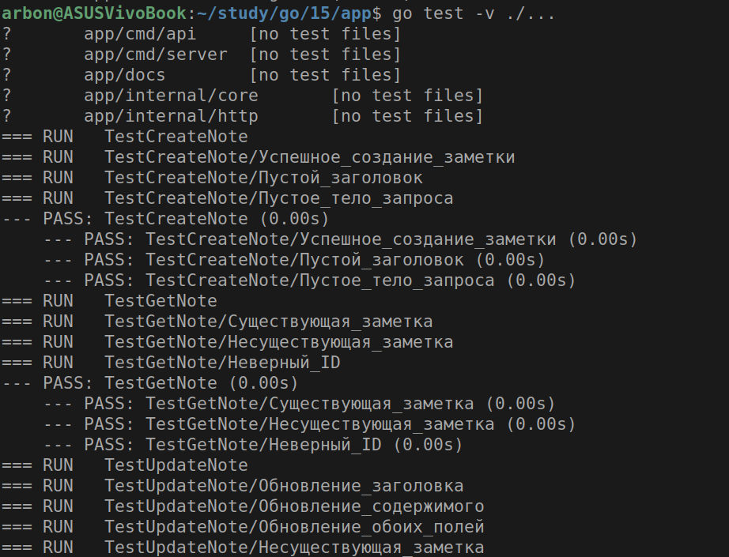
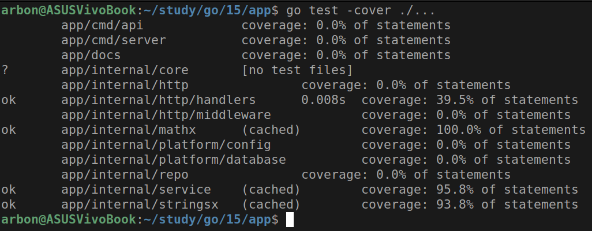
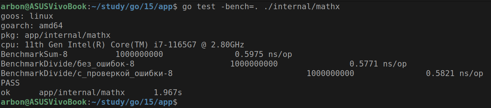

# Практическое задание 15. Unit-тестирование функций

Студент группы *ЭФМО-02-25 Бондарь Андрей Ренатович*

## Описание

**Цели:**

- Освоить базовые приёмы unit-тестирования в Go с помощью стандартного пакета `testing`
- Научиться писать табличные тесты, подзадачи `t.Run`, тестировать ошибки и паники
- Освоить библиотеку утверждений `testify` (assert, require) для лаконичных проверок
- Научиться измерять покрытие кода (`go test -cover`) и формировать HTML-отчёт покрытия
- Подготовить минимальную структуру проектных тестов и общий чек-лист качества тестов

---

## Дополнительные зависимости

```bash
go get github.com/stretchr/testify
go get go.uber.org/zap
```

---

## Структура проекта

```
app
├── cmd
│   ├── api
│   │   └── main.go
│   └── server
│       └── main.go
├── docs
│   ├── docs.go
│   ├── swagger.json
│   └── swagger.yaml
├── go.mod
├── go.sum
└── internal
    ├── core
    │   └── note.go
    ├── http
    │   ├── handlers
    │   │   ├── notes.go
    │   │   └── notes_test.go
    │   ├── middleware
    │   │   ├── cors.go
    │   │   └── logger.go
    │   └── router.go
    ├── mathx
    │   ├── mathx.go
    │   └── mathx_test.go
    ├── platform
    │   ├── config
    │   │   └── config.go
    │   └── database
    │       └── postgres.go
    ├── repo
    │   ├── interface.go
    │   └── note_pg.go
    ├── service
    │   ├── repo.go
    │   ├── service.go
    │   └── service_test.go
    └── stringsx
        ├── stringsx.go
        └── stringsx_test.go
```

---

## Реализация тестов

### Пакет `internal/mathx` - математические функции

**Файл: `mathx.go`**

```go
package mathx

import "errors"

func Sum(a, b int) int { 
    return a + b 
}

func Divide(a, b int) (int, error) {
    if b == 0 {
        return 0, errors.New("divide by zero")
    }
    return a / b, nil
}

func Max(a, b int) int {
    if a > b {
        return a
    }
    return b
}
```

**Файл: `mathx_test.go`**

**Ключевые компоненты:**

1. **Табличные тесты:**
   
   ```go
   func TestSum_Table(t *testing.T) {
       cases := []struct {
           name string
           a, b int
           want int
       }{
           {"положительные числа", 2, 3, 5},
           {"отрицательные числа", -2, -3, -5},
           {"ноль", 0, 0, 0},
       }
   
       for _, tc := range cases {
           t.Run(tc.name, func(t *testing.T) {
               got := Sum(tc.a, tc.b)
               if got != tc.want {
                   t.Errorf("Sum(%d, %d) = %d; want %d", tc.a, tc.b, got, tc.want)
               }
           })
       }
   }
   ```

2. **Использование testify:**
   
   ```go
   func TestDivide_OkAndError(t *testing.T) {
       t.Run("Успешное деление", func(t *testing.T) {
           result, err := Divide(10, 2)
           require.NoError(t, err)
           assert.Equal(t, 5, result)
       })
   
       t.Run("Деление на ноль", func(t *testing.T) {
           result, err := Divide(10, 0)
           assert.Error(t, err)
           assert.Equal(t, 0, result)
           assert.EqualError(t, err, "divide by zero")
       })
   }
   ```

3. **Бенчмарки:**
   
   ```go
   func BenchmarkSum(b *testing.B) {
       for i := 0; i < b.N; i++ {
           _ = Sum(123, 456)
       }
   }
   ```

**Архитектурное значение:**

- Демонстрация различных подходов к тестированию
- Покрытие позитивных и негативных сценариев
- Измерение производительности функций

### Пакет `internal/stringsx` - строковые функции

**Файл: `stringsx.go`**

```go
package stringsx

import (
    "strings"
    "unicode/utf8"
)

func Clip(s string, maxLength int) string {
    if maxLength < 0 {
        maxLength = 0
    }

    if utf8.RuneCountInString(s) <= maxLength {
        return s
    }

    runes := []rune(s)
    if len(runes) > maxLength {
        return string(runes[:maxLength])
    }
    return s
}
```

**Файл: `stringsx_test.go`**

**Ключевые компоненты:**

1. **Тестирование граничных случаев с `t.Run`:**
   
   ```go
   func TestClip(t *testing.T) {
       tests := []struct {
           name     string
           input    string
           max      int
           expected string
       }{
           {"пустая строка", "", 5, ""},
           {"max = 0", "hello", 0, ""},
           {"max < 0", "hello", -1, ""},
           {"UTF-8 символы", "привет мир", 6, "привет"},
       }
   
       for _, tt := range tests {
           t.Run(tt.name, func(t *testing.T) {
               result := Clip(tt.input, tt.max)
               assert.Equal(t, tt.expected, result)
           })
       }
   }
   ```

2. **Тестирование паники:**
   
   ```go
   func TestPanic(t *testing.T) {
       panicFunc := func(s string) {
           if s == "" {
               panic("пустая строка")
           }
       }
   
       t.Run("паника при пустой строке", func(t *testing.T) {
           assert.Panics(t, func() {
               panicFunc("")
           })
       })
   }
   ```

**Архитектурное значение:**

- Демонстрация тестирования UTF-8 безопасных функций
- Проверка обработки граничных значений
- Тестирование функций, вызывающих панику

### Пакет `internal/service` - тестирование с моками

**Файл: `repo.go`**

```go
package service

import "app/internal/core"

type UserRepo interface {
    ByEmail(email string) (User, error)
    ByID(id int64) (User, error)
}

type NoteRepo interface {
    GetByID(id int64) (*core.Note, error)
    Create(note core.Note) (int64, error)
}
```

**Файл: `service_test.go`**

**Ключевые компоненты:**

1. **Создание стабов и моков:**
   
   ```go
   type stubUserRepo struct {
       users map[string]User
   }
   
   func (r *stubUserRepo) ByEmail(email string) (User, error) {
       user, ok := r.users[email]
       if !ok {
           return User{}, ErrNotFound
       }
       return user, nil
   }
   ```

2. **Изолированное тестирование бизнес-логики:**
   
   ```go
   func TestService_FindIDByEmail(t *testing.T) {
       userRepo := &stubUserRepo{
           users: map[string]User{
               "test@example.com": {ID: 1, Email: "test@example.com"},
           },
       }
   
       service := NewService(nil, userRepo)
   
       t.Run("Найден существующий пользователь", func(t *testing.T) {
           id, err := service.FindIDByEmail("test@example.com")
           require.NoError(t, err)
           assert.Equal(t, int64(1), id)
       })
   }
   ```

**Архитектурное значение:**

- Демонстрация принципа Dependency Injection
- Изоляция бизнес-логики от внешних зависимостей
- Тестирование через интерфейсы

### Пакет `internal/http/handlers` - тестирование HTTP-хендлеров

**Файл: `notes_test.go`**

**Ключевые компоненты:**

1. **Мок репозитория:**
   
   ```go
   type mockNoteRepository struct {
       notes map[int64]*core.Note
       nextID int64
   }
   ```

2. **Тестирование HTTP-эндпоинтов:**
   
   ```go
   func TestCreateNote(t *testing.T) {
       repo := newMockNoteRepository()
       handler := &Handler{Repo: repo}
   
       body, _ := json.Marshal(core.NoteCreate{
           Title: "Test", 
           Content: "Content"
       })
   
       req := httptest.NewRequest("POST", "/notes", bytes.NewReader(body))
       req.Header.Set("Content-Type", "application/json")
   
       w := httptest.NewRecorder()
       handler.CreateNote(w, req)
   
       assert.Equal(t, http.StatusCreated, w.Code)
   }
   ```

3. **Тестирование с параметрами маршрута:**
   
   ```go
   func TestGetNote(t *testing.T) {
       req := httptest.NewRequest("GET", "/notes/1", nil)
   
       rctx := chi.NewRouteContext()
       rctx.URLParams.Add("id", "1")
       req = req.WithContext(context.WithValue(req.Context(), chi.RouteCtxKey, rctx))
   
       w := httptest.NewRecorder()
       handler.GetNote(w, req)
   }
   ```

**Архитектурное значение:**

- Тестирование HTTP-хендлеров без запуска сервера
- Мокирование зависимостей для изоляции
- Работа с контекстом маршрутизации Chi

---

## Тестирование API эндпоинтов

В файле `notes_test.go` представлены юнит-тесты
для HTTP-обработчиков (handlers) API заметок.
Тесты покрывают основные CRUD-операции:

1. **Создание заметки** (`TestCreateNote`)  
   Проверяет успешное создание, пустой заголовок и пустое тело запроса.

2. **Получение заметки по ID** (`TestGetNote`)  
   Проверяет получение существующей, несуществующей заметки и невалидный ID.

3. **Обновление заметки** (`TestUpdateNote`)  
   Тестирует обновление заголовка, содержимого, обоих полей и попытку обновления несуществующей заметки.

4. **Удаление заметки** (`TestDeleteNote`)  
   Проверяет удаление существующей, несуществующей заметки и обработку невалидного ID.

5. **Получение всех заметок** (`TestGetAllNotes`)  
   Проверяет получение списка заметок (включая пустой список).

**Особенности тестирования:**

- Используется мок-репозиторий (`mockNoteRepository`), имитирующий работу с базой данных.
- Применяются библиотеки `testify/assert` и `testify/require` для проверок.
- Для эмуляции HTTP-запросов используется `httptest`.
- Тесты изолированы и не зависят от внешних ресурсов.

Тесты проверяют как успешные сценарии,
так и обработку ошибок (невалидные данные, отсутствующие записи).

---

## Запуск тестов и результаты

### Команды запуска

Запуск всех тестов

```bash
go test ./...
```



Запуск с подробным выводом

```bash
go test -v ./...
```



Запуск с измерением покрытия

```bash
go test -cover ./...
```



Запуск бенчмарков

```bash
go test -bench=. ./internal/mathx
```



---

## Заключение

В ходе практической работы успешно реализовано unit-тестирование для проекта Notes API.

Работа демонстрирует полное освоение unit-тестирования в Go
и готовность к промышленной разработке с соблюдением
лучших практик обеспечения качества кода.
