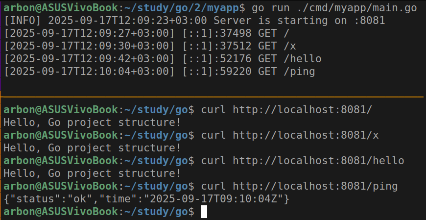
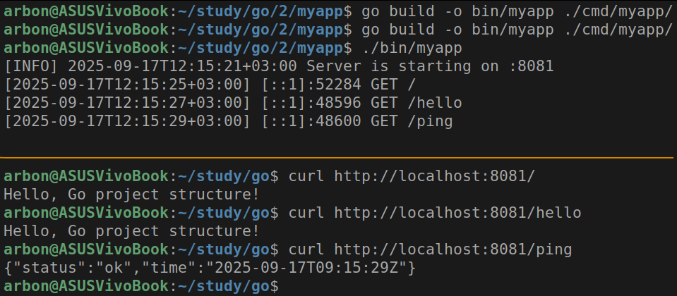
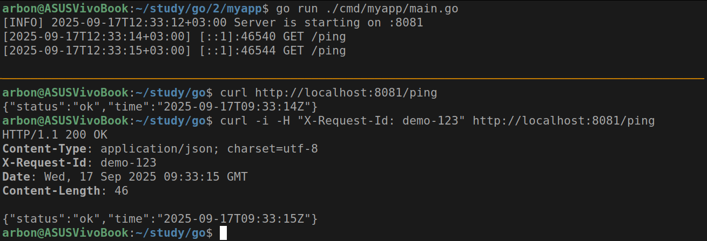
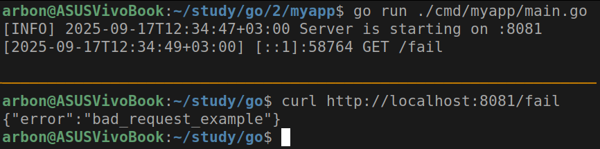
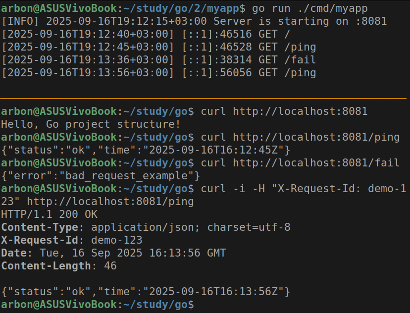

# Практическое задание 2

Студент группы *ЭФМО-02-25 Бондарь Андрей Ренатович*

## Описание

**Цели:**
- Понять назначение ключевых директорий (cmd/, internal/, pkg/ и др.).
- Научиться раскладывать код и артефакты проекта по "правильным" местам.
- Собрать минимальный скелет проекта и запустить "пустой" main.go.

## Создание структуры проекта

```bash
mkdir -p ~/myapp/cmd/myapp ~/myapp/internal/app ~/myapp/utils
cd ~/myapp
```

### Инициализация модуля

```bash
go mod init example.com/myapp
```

### Создание файлов проекта

Создаём три файла:
1. cmd/myapp/main.go - минимальный вход.
2. internal/app/app.go - "сердце" приложения.
3. utils/logger.go - простой логгер.

Содержание cmd/myapp/main.go:

```go
cmd/myapp/main.go
package main
import "myapp/internal/app"
func main() {
	app.Run()
}
```

Содержание internal/app/app.go:

```go
package app
import (
	"encoding/json"
	"fmt"
	"net/http"
	"time"
	"myapp/utils"
)
type pingResp struct {
	Status string `json:"status"`
	Time   string `json:"time"`
}
func Run() {
	mux := http.NewServeMux()
	mux.HandleFunc("/", func(w http.ResponseWriter, r *http.Request) {
		utils.LogRequest(r)
		w.Header().Set("Content-Type", "text/plain; charset=utf-8")
		fmt.Fprintln(w, "Hello, Go project structure!")
	})
	mux.HandleFunc("/ping", func(w http.ResponseWriter, r *http.Request) {
		utils.LogRequest(r)
		w.Header().Set("Content-Type", "application/json; charset=utf-8")
		_ = json.NewEncoder(w).Encode(pingResp{
			Status: "ok", Time: time.Now().UTC().Format(time.RFC3339),
		})
	})
	utils.LogInfo("Server is starting on :8081")
	if err := http.ListenAndServe(":8081", mux); err != nil {
		utils.LogError("server error: " + err.Error())
	}
}
```

Содержание utils/logger.go:

```go
package utils
import (
	"fmt"
	"net/http"
	"time"
)
func LogRequest(r *http.Request) {
	fmt.Printf("[%s] %s %s %s\n",
		time.Now().Format(time.RFC3339), r.RemoteAddr, r.Method, r.URL.Path,
	)
}
func LogInfo(msg string) {
	fmt.Printf("[INFO] %s %s\n", time.Now().Format(time.RFC3339), msg)
}
func LogError(msg string) {
	fmt.Printf("[ERROR] %s %s\n", time.Now().Format(time.RFC3339), msg)
}
```

## Запуск и проверка

```bash
go run ./cmd/myapp
```

Проверка запущенного API (в другом терминале):

```bash
curl http://localhost:8081/<текст>
curl http://localhost:8081/ping
```



## Сборка бинарника

```bash
go build -o bin/myapp ./cmd/server
./helloapi
```



Заметим, что ответы `curl` совпадают с предыдущим шагом.

## Упражнение A (Request-ID)

Добавляем в utils/logger.go генератор:

```go
package utils
import (
	"crypto/rand"
	"encoding/hex"
	// ...
)
func NewID16() string {
	b := make([]byte, 8)
	_, _ = rand.Read(b)
	return hex.EncodeToString(b)
}
```

Добавляем в internal/app/app.go middleware-обёртку и ее использование:

```go
func withRequestID(next http.Handler) http.Handler {
	return http.HandlerFunc(func(w http.ResponseWriter, r *http.Request) {
		id := r.Header.Get("X-Request-Id")
		if id == "" {
			id = utils.NewID16()
		}
		w.Header().Set("X-Request-Id", id)
		next.ServeHTTP(w, r)
	})
}
func Run() {
	// ...
	handler := withRequestID(mux)
	utils.LogInfo("Server is starting on :8081")
	if err := http.ListenAndServe(":8081", handler); err != nil {
		utils.LogError("server error: " + err.Error())
	}
}
```



### Упражнение B (JSON ошибки)

Создадим утилиту для ответов в JSON (utils/httpjson.go):

```go
package utils
import (
	"encoding/json"
	"net/http"
)
type JSONError struct {
	Error string `json:"error"`
}
func WriteJSON(w http.ResponseWriter, code int, v any) {
	w.Header().Set("Content-Type", "application/json; charset=utf-8")
	w.WriteHeader(code)
	_ = json.NewEncoder(w).Encode(v)
}
func WriteErr(w http.ResponseWriter, code int, msg string) {
	WriteJSON(w, code, JSONError{Error: msg})
}
```

И добавим новый маршрут с ошибкой (в internal/app/app.go):

```go
mux.HandleFunc("/fail", func(w http.ResponseWriter, r *http.Request) {
	utils.LogRequest(r)
	utils.WriteErr(w, http.StatusBadRequest, "bad_request_example")
})
```



## Упражнение C (Разделение обработчиков)

Создадим пакет для хендлеров:

```bash
mkdir -p internal/app/handlers
```

Создаем файл internal/app/handlers/ping.go:

```go
package handlers
import (
	"encoding/json"
	"net/http"
	"time"
	"myapp/utils"
)
type pingResp struct {
	Status string `json:"status"`
	Time   string `json:"time"`
}
func Ping(w http.ResponseWriter, r *http.Request) {
	utils.LogRequest(r)
	w.Header().Set("Content-Type", "application/json; charset=utf-8")
	_ = json.NewEncoder(w).Encode(pingResp{
		Status: "ok",
		Time:   time.Now().UTC().Format(time.RFC3339),
	})
}
```

И исправим регистрацию маршрутов в internal/app/app.go:

```go
import (
	// ...
	"myapp/internal/app/handlers"
)
// ...
func Run() {
	mux := http.NewServeMux()
    // ...
    mux.HandleFunc("/ping", handlers.Ping)  // новая регистрация маршрутов
    // ...
	handler := withRequestID(mux)
	utils.LogInfo("Server is starting on :8081")
	if err := http.ListenAndServe(":8081", handler); err != nil {
		utils.LogError("server error: " + err.Error())
	}
}
```

Перепроверим работоспособность:




## Структура проекта

```
myapp/
├── cmd/
│   └── myapp/
│       └── main.go
├── internal/
│   └── app/
│       ├── app.go
│       └── handlers/
│           └── ping.go
├── utils/
│   ├── logger.go
│   └── httpjson.go
└── go.mod
```

