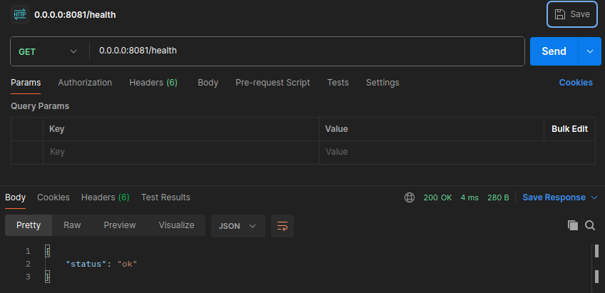
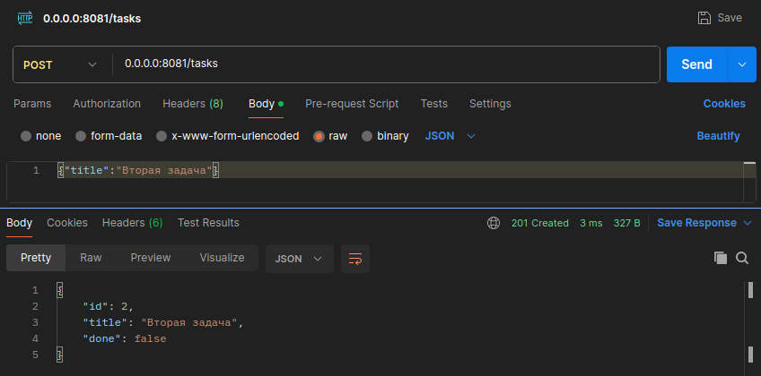
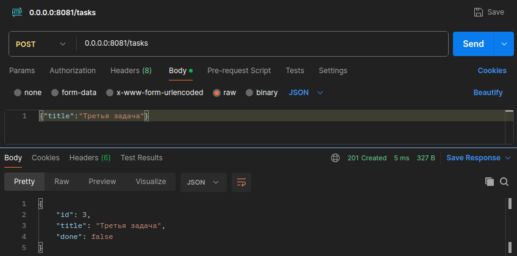
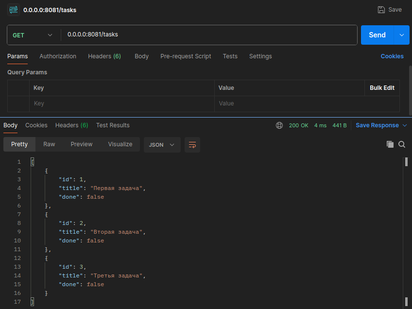
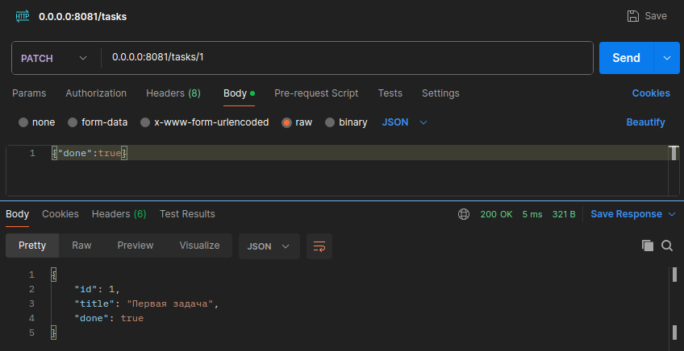
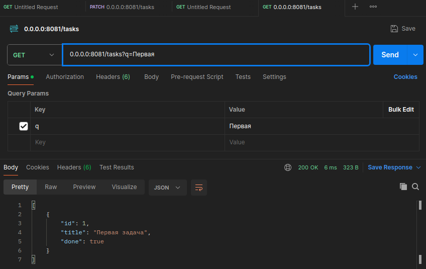
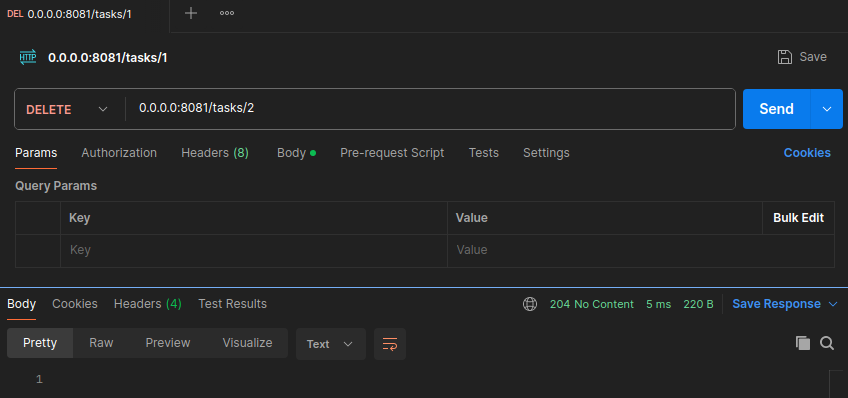
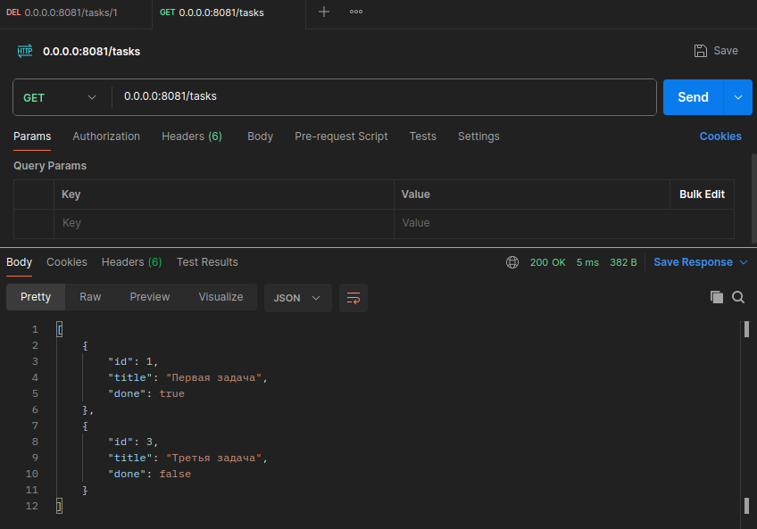
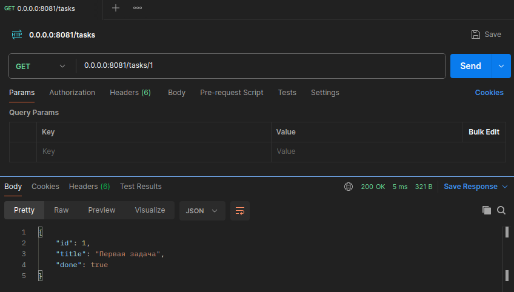
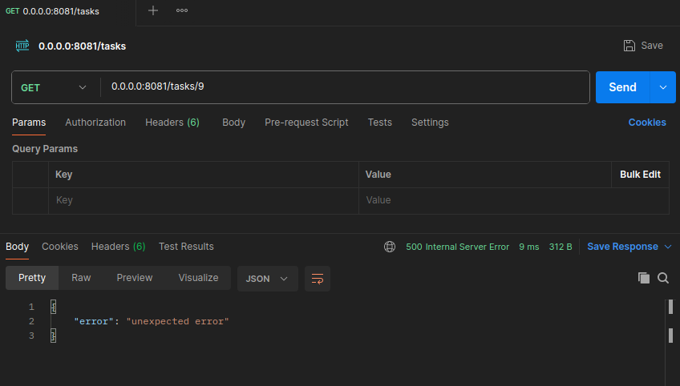

# Практическое задание 4. Реализация простого HTTP-сервера на стандартной библиотеке net/http

Студент группы *ЭФМО-02-25 Бондарь Андрей Ренатович*

## Описание

**Цели:**

- Освоить базовую работу со стандартной библиотекой net/http без сторонних фреймворков.
- Научиться поднимать HTTP-сервер, настраивать маршрутизацию через http.ServeMux.
- Научиться обрабатывать параметры запроса (query, path), тело запроса (JSON/form-data) и формировать корректные ответы (код статуса, заголовки, JSON).
- Научиться базовому логированию запросов и обработке ошибок.

## Инициализация проекта

```bash
mkdir -p app/cmd/server app/internal/api app/internal/storage/
cd ~/app
go mod init app
```

## Структура проекта

```
app
├── cmd
│   └── server
│       └── main.go
├── go.mod
└── internal
    ├── api
    │   ├── handlers.go
    │   ├── middleware.go
    │   └── responses.go
    └── storage
        └── memory.go
```

## Реализация

Так как объем кода велик, дадим краткое описание файлов.

### cmd/server/main.go

Точка входа приложения:

- Настройка HTTP-сервера с портом из переменной окружения PORT;
- Регистрация всех маршрутов API;
- Подключение middleware (CORS -> Logging -> Router);
- Эндпоинт `/health` для проверки работоспособности.

### internal/storage/memory.go

In-memory хранилище задач с потокобезопасностью:

- Автоматическая генерация ID;
- CRUD операции для задач;
- Синхронизация через `sync.RWMutex`.

### internal/api/responses.go

Утилиты для стандартизированных HTTP-ответов:

- `JSON()` - универсальный JSON-ответ;
- `BadRequest()`, `NotFound()`, `Internal()`, `UnprocessableEntity()` - готовые ошибки;
- Единый формат ошибок: `{"error": "message"}`.

### internal/api/handlers.go

HTTP-обработчики с полной валидацией:

- `GET /tasks` - список задач с фильтрацией (`?q=поиск`);
- `POST /tasks` - создание задачи (валидация: 3-140 символов);
- `GET /tasks/{id}` - получение задачи по ID;
- `PATCH /tasks/{id}` - частичное обновление (заголовок/статус);
- `DELETE /tasks/{id}` - удаление задачи.

### internal/api/middleware.go

Промежуточное ПО:

- `Logging` - детальное логирование запросов;
- `CORS` - поддержка кросс-доменных запросов.

## Тестирование

### Проверяем, что сервер работает

```bash
curl http://0.0.0.0:8081/health
```



### Создаем несколько задач

Первая:

```bash
curl -X POST http://0.0.0.0:8081/tasks \
    -H "Content-Type: application/json" \
    -d '{"title":"Первая задача"}'
```


Вторая:

```bash
curl -X POST http://0.0.0.0:8081/tasks \
    -H "Content-Type: application/json" \
    -d '{"title":"Вторая задача"}'
```



Третья:

```bash
curl -X POST http://0.0.0.0:8081/tasks \
    -H "Content-Type: application/json" \
    -d '{"title":"Третья задача"}'
```



### Получаем все задачи

```
curl http://0.0.0.0:8081/tasks
```



### Обновляем первую задачу

```
curl -X PATCH http://0.0.0.0:8081/tasks/1 \
    -H "Content-Type: application/json" \
    -d '{"done":true}'
```



### Фильтруем задачи

```
curl "http://0.0.0.0:8081/tasks?q=Первая"
```



### Удаляем вторую задачу

```
curl -X DELETE http://0.0.0.0:8081/tasks/2
```



Проверяем:

```
curl http://0.0.0.0:8081/tasks
```



### Получить задачу по индентификатору

```
curl http://0.0.0.0:8081/tasks/1
```



### Получение задачи по несуществующему индентификатору

```
curl http://0.0.0.0:8081/tasks/9
```



