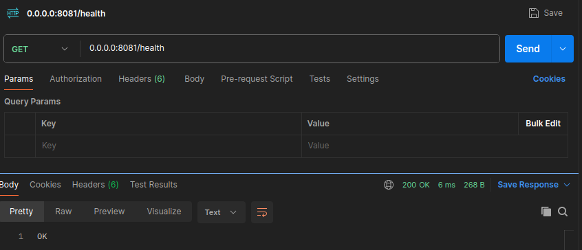
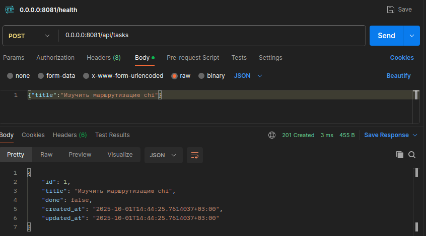
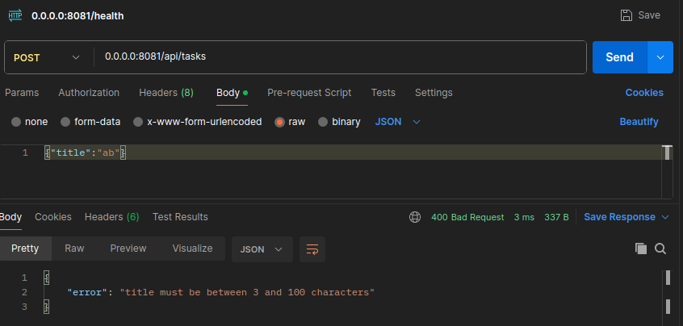
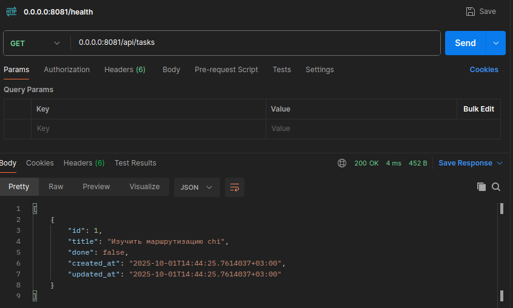
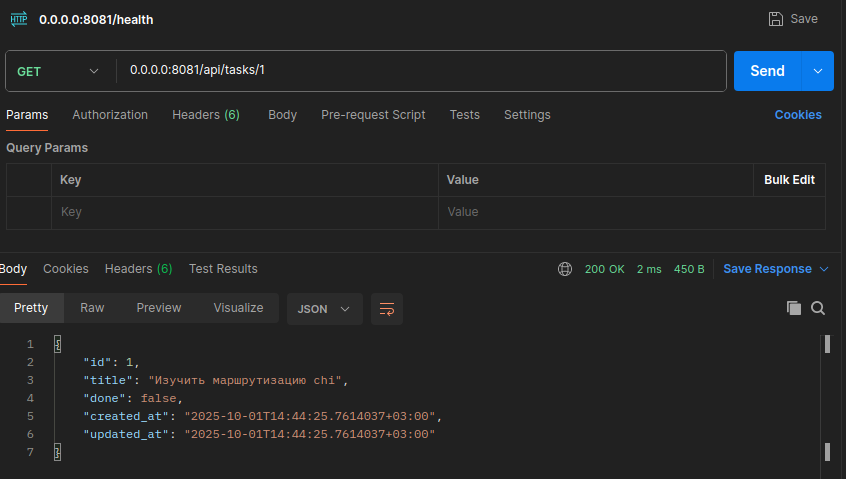
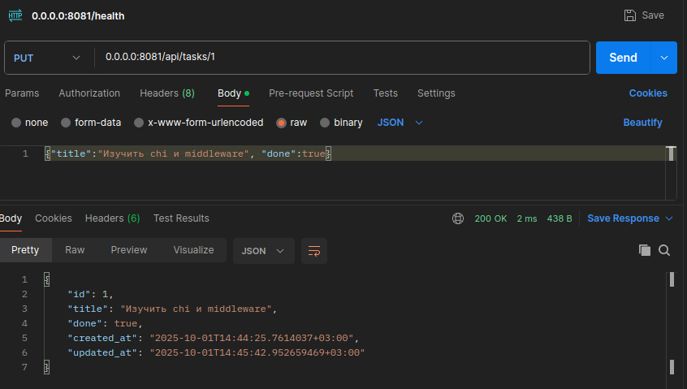
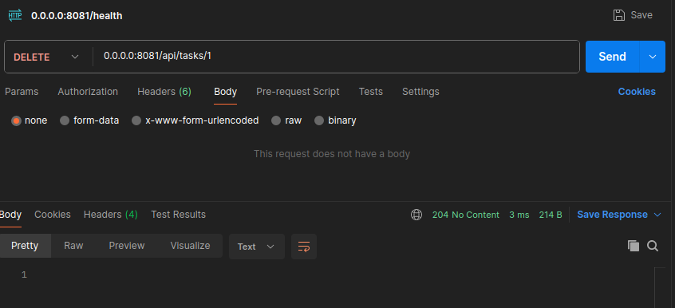
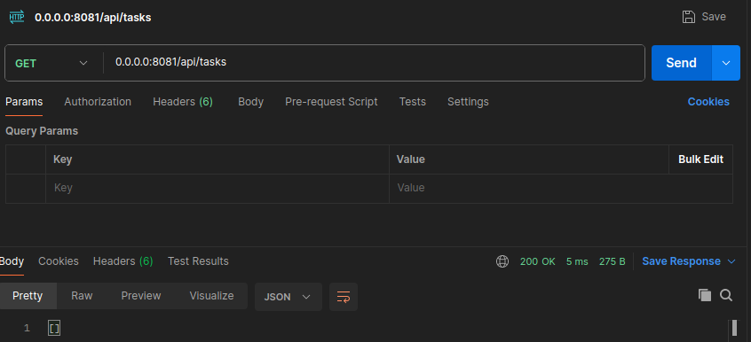

# Практическое задание 4. Реализация CRUD-сервиса "Список задач" с использованием роутера chi

Студент группы *ЭФМО-02-25 Бондарь Андрей Ренатович*

## Описание

**Цели:**

- Освоить базовую маршрутизацию HTTP-запросов в Go на примере роутера chi;
- Научиться строить REST-маршруты и обрабатывать методы `GET/POST/PUT/DELETE`;
- Реализовать небольшой CRUD-сервис "ToDo" (без БД, хранение в памяти);
- Добавить простое middleware (логирование, CORS);
- Научиться тестировать API запросами через curl/Postman/HTTPie.

## Инициализация проекта

```bash
mkdir -p app/cmd/server app/internal/task app/pkg/middleware
cd app
go mod init app
go get github.com/go-chi/chi/v5
go get github.com/go-chi/chi/v5/middleware
```

## Структура проекта

```
app
├── cmd
│   └── server
│       └── main.go
├── go.mod
├── go.sum
├── internal
│   └── task
│       ├── handler.go
│       ├── model.go
│       └── repo.go
└── pkg
    └── middleware
        ├── cors.go
        └── logger.go
```

## Реализация

### cmd/server/main.go

Точка входа приложения:

- Инициализация роутера chi с middleware (`RequestID`, `Recoverer`, `Logger`, `CORS`);
- Регистрация маршрутов API с префиксом `/api`;
- Эндпоинт `/health` для проверки работоспособности;
- Запуск сервера на порту 8081.

```go
func main() {
    repo := task.NewRepo()
    h := task.NewHandler(repo)

    r := chi.NewRouter()
    r.Use(chimw.RequestID)
    r.Use(chimw.Recoverer)
    r.Use(myMW.Logger)
    r.Use(myMW.SimpleCORS)

    r.Get("/health", func(w http.ResponseWriter, r *http.Request) {
        w.Write([]byte("OK"))
    })

    r.Route("/api", func(api chi.Router) {
        api.Mount("/tasks", h.Routes())
    })

    addr := ":8081"
    log.Printf("listening on %s", addr)
    log.Fatal(http.ListenAndServe(addr, r))
}
```

### internal/task/model.go

Модель данных задачи:

```go
type Task struct {
    ID        int64     `json:"id"`
    Title     string    `json:"title"`
    Done      bool      `json:"done"`
    CreatedAt time.Time `json:"created_at"`
    UpdatedAt time.Time `json:"updated_at"`
}
```

### internal/task/repo.go

In-memory хранилище задач с потокобезопасностью:

- Автоматическая генерация ID через sequence;
- CRUD операции для задач с использованием `sync.RWMutex`;
- Обработка ошибок (`ErrNotFound`).

```go
type Repo struct {
    mu    sync.RWMutex
    seq   int64
    items map[int64]*Task
}

func (r *Repo) Create(title string) *Task {
    r.mu.Lock()
    defer r.mu.Unlock()

    r.seq++
    now := time.Now()
    t := &Task{
        ID:        r.seq,
        Title:     title,
        CreatedAt: now,
        UpdatedAt: now,
        Done:      false,
    }
    r.items[t.ID] = t
    return t
}
```

### internal/task/handler.go

HTTP-обработчики с полной валидацией:

- Валидация длины заголовка (3-100 символов);
- Обработка параметров пути (`{id}`);
- Парсинг и валидация JSON тела запроса;
- Корректные HTTP статусы для всех операций.

```go
func (h *Handler) create(w http.ResponseWriter, r *http.Request) {
    var req createReq
    if err := json.NewDecoder(r.Body).Decode(&req); err != nil {
        httpError(w, http.StatusBadRequest, "invalid json")
        return
    }

    req.Title = validateTitle(req.Title)
    if req.Title == "" {
        httpError(w, http.StatusBadRequest, "title must be between 3 and 100 characters")
        return
    }

    t := h.repo.Create(req.Title)
    writeJSON(w, http.StatusCreated, t)
}
```

### pkg/middleware

Промежуточное ПО:

- `Logger` - логирование метода, пути и времени выполнения запроса;
- `SimpleCORS` - поддержка кросс-доменных запросов с предварительными проверками OPTIONS.

```go
func Logger(next http.Handler) http.Handler {
    return http.HandlerFunc(func(w http.ResponseWriter, r *http.Request) {
        start := time.Now()
        next.ServeHTTP(w, r)
        log.Printf("%s %s %s", r.Method, r.URL.Path, time.Since(start))
    })
}
```

## Тестирование

### Проверяем, что сервер работает

```bash
curl -i 0.0.0.0:8081/health
```



### Создаем задачу

```bash
curl -i -X POST 0.0.0.0:8081/api/tasks \
  -H "Content-Type: application/json" \
  -d '{"title":"Изучить маршрутизацию chi"}'
```



### Проверяем валидацию (короткий заголовок)

```bash
curl -i -X POST 0.0.0.0:8081/api/tasks \
  -H "Content-Type: application/json" \
  -d '{"title":"ab"}'
```



### Получаем список задач

```bash
curl -i 0.0.0.0:8081/api/tasks
```



### Получаем задачу по ID

```bash
curl -i 0.0.0.0:8081/api/tasks/1
```



### Обновляем задачу

```bash
curl -i -X PUT 0.0.0.0:8081/api/tasks/1 \
  -H "Content-Type: application/json" \
  -d '{"title":"Изучить chi и middleware", "done":true}'
```



### Удаляем задачу

```bash
curl -i -X DELETE 0.0.0.0:8081/api/tasks/1
```



#### Проверяем список после удаления

```bash
curl -i 0.0.0.0:8081/api/tasks
```


