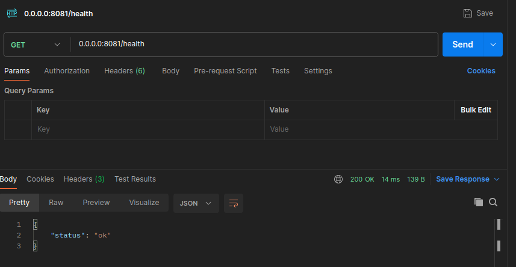
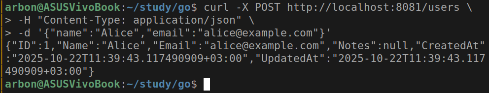
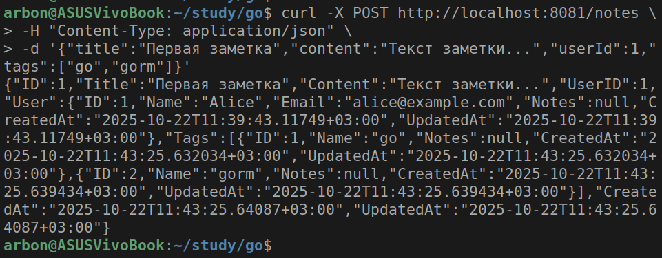
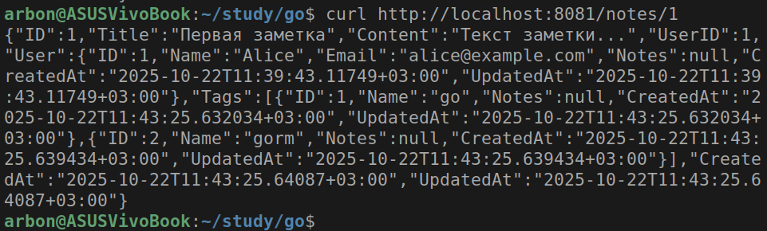

# Практическое задание 6. Использование ORM (GORM). Модели, миграции и связи между таблицами.

Студент группы *ЭФМО-02-25 Бондарь Андрей Ренатович*

## Описание

**Цели:**

- Понять, что такое ORM и чем удобен GORM.
- Научиться описывать модели Go-структурами и автоматически создавать таблицы (миграции через AutoMigrate).
- Освоить базовые связи: 1:N и M:N + выборки с Preload.
- Написать короткий REST (2-3 ручки) для проверки результата.


## Инициализация проекта

```bash
mkdir -p app/cmd/server app/internal/{db,models,httpapi}
cd app
go mod init app
go get gorm.io/gorm gorm.io/driver/postgres
go get github.com/go-chi/chi/v5
go get github.com/joho/godotenv
```

## Структура проекта

```
app
├── cmd
│   └── server
│       └── main.go
├── go.mod
├── go.sum
└── internal
    ├── db
    │   └── postgres.go
    ├── httpapi
    │   ├── handlers.go
    │   └── router.go
    └── models
        └── models.go
```

## Реализация

### Модели данных (internal/models/models.go)

Реализованы три основные сущности со связями:
- **User** - пользователь с полями ID, Name, Email и связью "один-ко-многим" с заметками
- **Note** - заметка с полями Title, Content, UserID и связью "многие-ко-многим" с тегами
- **Tag** - тег с полем Name и обратной связью с заметками

Для связей использованы GORM теги: `gorm:"many2many:note_tags;"` для связи M:N и автоматические поля CreatedAt/UpdatedAt для временных меток.

### Подключение к БД (internal/db/postgres.go)

Реализована функция `Connect()`, которая:
- Читает DSN из переменной окружения POSTGRESQL_DSN
- Настраивает пул соединений (20 максимальных, 10 idle-соединений)
- Устанавливает логгирование для GORM
- Обрабатывает ошибки подключения

### HTTP обработчики (internal/httpapi/handlers.go)

Созданы три основных эндпоинта:
- `POST /users` - создание пользователя с валидацией обязательных полей
- `POST /notes` - создание заметки с автоматическим созданием/привязкой тегов
- `GET /notes/{id}` - получение заметки с подгрузкой связанных данных через Preload

### Роутинг (internal/httpapi/router.go)

Использован маршрутизатор Chi для организации REST API. Реализованы маршруты для health-check и CRUD операций.

### Главный модуль (cmd/server/main.go)

Точка входа приложения выполняет:
- Подключение к базе данных
- Автоматические миграции через `AutoMigrate()`
- Запуск HTTP сервера на порту 8081

## Настройка базы данных

### Создание БД и таблиц

База данных создана командой:
```sql
CREATE DATABASE go_6;
```

Таблицы автоматически создаются при запуске приложения через `AutoMigrate()`, который генерирует:
- Таблицы `users`, `notes`, `tags` на основе структур
- Промежуточную таблицу `note_tags` для связи M:N
- Индексы для уникальных полей (email, name тегов)

### Конфигурация подключения (.env)

Параметры подключения задаются через переменную окружения POSTGRESQL_DSN в формате:
```
host=localhost user=postgres password=your_password dbname=go_6 port=5432 sslmode=disable
```

## Тестирование

Проведено тестирование всех эндпоинтов с помощью curl:

1. **Health check** - проверка работоспособности сервера
2. **Создание пользователя** - валидация уникальности email
3. **Создание заметки** - автоматическая обработка тегов через FirstOrCreate
4. **Получение заметки** - проверка работы Preload для связей

Все операции выполняются корректно, связи между таблицами работают как ожидалось.

### Проверка здоровья
```bash
curl http://localhost:8081/health
```



### Создание пользователя
```bash
curl -X POST http://localhost:8081/users \
  -H "Content-Type: application/json" \
  -d '{"name":"Alice","email":"alice@example.com"}'
```



### Создание заметки с тегами
```bash
curl -X POST http://localhost:8081/notes \
  -H "Content-Type: application/json" \
  -d '{"title":"Первая заметка","content":"Текст заметки...","userId":1,"tags":["go","gorm"]}'
```



### Получение заметки
```bash
curl http://localhost:8081/notes/1
```



## Особенности реализации

GORM автоматически создает таблицы и добавляет новые поля, но не удаляет столбцы и не изменяет типы существующих полей.

Связь 1:N реализована через поле `UserID` в Note и срез `[]Note` в User.
Связь M:N реализована через тег `many2many` и автоматическую таблицу
`note_tags`.
Для загрузки связанных данных используется `Preload()`.

В результате реализовано работоспособное REST API с полной поддержкой ORM, связей между таблицами и автоматическими миграциями.

## Демонстрация

Работоспособность API можно проверить по адресу:  
**http://arbond.ru/go/6**

На этом адресе размещено рабочее демо-приложение.
Для тестирования эндпоинтов можно использовать curl-команды,
приведенные выше, заменив localhost:8081 на arbond.ru/go/6.

