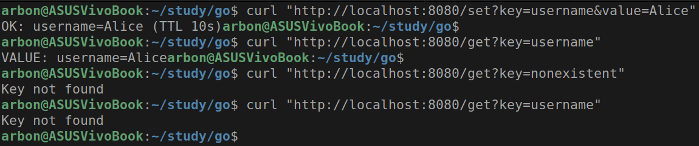
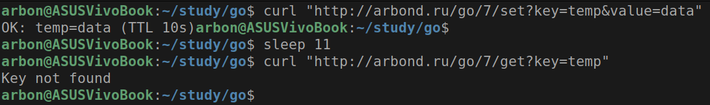
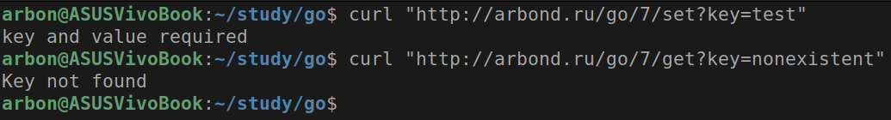

# Практическое задание 7. Подключение и работа с Redis (set/get, TTL). Реализация простого кэша.

Студент группы *ЭФМО-02-25 Бондарь Андрей Ренатович*

## Описание

**Цели:**
- Освоить базовые операции работы с Redis из Go-приложения.
- Научиться использовать команды SET, GET, задавать время жизни ключей (TTL).
- Реализовать кэширование данных для ускорения работы API.
- Понять, в каких случаях кэш помогает снизить нагрузку на базу данных.


---


## Инициализация проекта

```bash
mkdir -p app/cmd/server app/internal/cache
cd app
go mod init app
go get github.com/redis/go-redis/v9
go get github.com/joho/godotenv
```


---


## Структура проекта

```
app
├── cmd
│   └── server
│       └── main.go
├── go.mod
├── go.sum
└── internal
    └── cache
        └── cache.go
```


---


## Реализация

В этом разделе описывается реализация ключевых компонентов приложения
с объяснением назначения каждого файла и его роли в системе.

### Файл: `internal/cache/cache.go`

Инкапсуляция логики работы с Redis
и предоставление абстрактного интерфейса кэширования.

**Ключевые компоненты:**

1. **Структура Cache:**
```go
type Cache struct {
    rdb *redis.Client
}
```
Обертка вокруг Redis клиента, скрывающая детали реализации.

2. **Конструктор New:**
```go
func New(addr string) *Cache {
    rdb := redis.NewClient(&redis.Options{
        Addr:     addr,
        Password: "", // нет пароля
        DB:       0,  // база по умолчанию
    })
    return &Cache{rdb: rdb}
}
```
Инициализирует подключение к Redis с переданным адресом.

3. **Метод Set:**
```go
func (c *Cache) Set(key string, value string, ttl time.Duration) error {
    ctx := context.Background()
    return c.rdb.Set(ctx, key, value, ttl).Err()
}
```
Сохраняет значение в Redis с заданным TTL, использует контекст для управления таймаутами.

4. **Метод Get:**
```go
func (c *Cache) Get(key string) (string, error) {
    ctx := context.Background()
    return c.rdb.Get(ctx, key).Result()
}
```
Извлекает значение по ключу, возвращает ошибку если ключ не найден.

5. **Метод TTL:**
```go
func (c *Cache) TTL(key string) (time.Duration, error) {
    ctx := context.Background()
    return c.rdb.TTL(ctx, key).Result()
}
```
Проверяет оставшееся время жизни ключа.

6. **Метод Delete:**
```go
func (c *Cache) Delete(key string) error {
    ctx := context.Background()
    return c.rdb.Del(ctx, key).Err()
}
```
Удаляет ключ из Redis.

**Архитектурное значение:**
- Инкапсулирует всю Redis-специфичную логику
- Предоставляет чистый интерфейс для работы с кэшем
- Обеспечивает повторное использование кода
- Облегчает тестирование через dependency injection

### Файл: `cmd/server/main.go`

Точка входа приложения, реализация HTTP сервера и REST API.

**Ключевые компоненты:**

1. **Инициализация и конфигурация:**
```go
c := cache.New("localhost:6379")
defer c.Close()
```
Создает экземпляр кэша с подключением к локальному Redis.

2. **Маршрутизация:**
```go
mux := http.NewServeMux()
```
Использует стандартный роутер HTTP для обработки запросов.

3. **Эндпоинт /set:**
```go
mux.HandleFunc("/set", func(w http.ResponseWriter, r *http.Request) {
    key := r.URL.Query().Get("key")
    value := r.URL.Query().Get("value")
    // Валидация параметров
    err := c.Set(key, value, 10*time.Second)
    // Обработка результата
})
```
Обрабатывает сохранение данных с валидацией входных параметров.

4. **Эндпоинт /get:**
```go
mux.HandleFunc("/get", func(w http.ResponseWriter, r *http.Request) {
    key := r.URL.Query().Get("key")
    val, err := c.Get(key)
    if err != nil {
        http.Error(w, "Key not found", http.StatusNotFound)
        return
    }
    fmt.Fprintf(w, "VALUE: %s=%s", key, val)
})
```
Обрабатывает получение данных с корректной обработкой ошибки "ключ не найден".

5. **Эндпоинты /ttl и /del:**
Аналогично реализуют проверку TTL и удаление ключей с соответствующей валидацией.

6. **Запуск сервера:**
```go
log.Println("Server starting on :8080")
log.Fatal(http.ListenAndServe(":8080", mux))
```
Запускает HTTP сервер на порту 8080 с логированием.

**Архитектурное значение:**
- Отделяет транспортный уровень (HTTP) от бизнес-логики (кэш)
- Реализует RESTful API для взаимодействия с системой
- Обрабатывает ошибки на уровне HTTP
- Предоставляет единую точку входа для приложения


---


## Документация API эндпоинтов

### Эндпоинт: `GET /set`

Сохранение значения в кэш с заданным TTL.

**Полный URL:** `http://arbond.ru/go/7/set?key=имя_ключа&value=значение`

**Параметры:**
- `key` (обязательный) - ключ для сохранения
- `value` (обязательный) - значение для сохранения

**Пример запроса:**
```http
GET http://arbond.ru/go/7/set?key=username&value=JohnDoe
```

**Успешный ответ (200 OK):**
```
OK: username=JohnDoe (TTL 10s)
```

**Ошибки:**
- `400 Bad Request` - если отсутствуют key или value
- `500 Internal Server Error` - при ошибках Redis

### Эндпоинт: `GET /get`

Получение значения из кэша по ключу.

**Полный URL:** `http://arbond.ru/go/7/get?key=имя_ключа`

**Параметры:**
- `key` (обязательный) - ключ для поиска

**Пример запроса:**
```http
GET http://arbond.ru/go/7/get?key=username
```

**Успешный ответ (200 OK):**
```
VALUE: username=JohnDoe
```

**Ошибки:**
- `400 Bad Request` - если отсутствует key
- `404 Not Found` - если ключ не найден
- `500 Internal Server Error` - при ошибках Redis

### Эндпоинт: `GET /ttl`

Проверка оставшегося времени жизни ключа.

**Полный URL:** `http://arbond.ru/go/7/ttl?key=имя_ключа`

**Параметры:**
- `key` (обязательный) - ключ для проверки

**Пример запроса:**
```http
GET http://arbond.ru/go/7/ttl?key=username
```

**Успешный ответ (200 OK):**
```
TTL for username: 8.4s
```

**Ошибки:**
- `400 Bad Request` - если отсутствует key
- `500 Internal Server Error` - при ошибках Redis

### Эндпоинт: `GET /del`

Удаление ключа из кэша.

**Параметры:**
- `key` (обязательный) - ключ для удаления

**Пример запроса:**
```http
GET /del?key=username
```

**Успешный ответ (200 OK):**
```
DELETED: username
```

**Ошибки:**
- `400 Bad Request` - если отсутствует key
- `500 Internal Server Error` - при ошибках Redis


---


## Запуск Redis

### Запуск через Docker (рекомендуемый)

Запуск Redis в контейнере
```bash
docker run --name redis -p 6379:6379 -d redis
```

Проверка статуса
```bash
docker ps
```

Остановка контейнера (когда нужно завершить работу)
```bash
docker stop redis
```


---


## Тестирование

### Сохранение значения

```bash
curl "http://arbond.ru/go/7/set?key=email&value=user@example.com"
```
Ответ: OK: email=user@example.com (TTL 10s)

### Получение значения
```bash
curl "http://arbond.ru/go/7/get?key=email"
```
Ответ: VALUE: email=user@example.com

### Проверка TTL
```bash
curl "http://arbond.ru/go/7/ttl?key=email"
```
Ответ: TTL for email: 9.1s

### Удаление ключа
```bash
curl "http://arbond.ru/go/7/del?key=email"
```
Ответ: DELETED: email

### Попытка получить удаленный ключ
```bash
curl "http://arbond.ru/go/7/get?key=email"
```
Ответ: Key not found (404)



### Тест истечения TTL
```bash
curl "http://arbond.ru/go/7/set?key=temp&value=data"
sleep 11
curl "http://arbond.ru/go/7/get?key=temp"
```
Ответ: Key not found (TTL истек)



### Тестирование обработки ошибок:

#### Неполные параметры
```bash
curl "http://arbond.ru/go/7/set?key=test"
```
Ответ: key and value required (400)

##### Отсутствующий ключ
```bash
curl "http://arbond.ru/go/7/get?key=nonexistent"
```
Ответ: Key not found (404)




---


## Заключение

В ходе практической работы успешно реализовано Go-приложение для работы с Redis.
Приложение предоставляет 4 основных эндпоинта
для выполнения базовых операций с кэшем:

- **http://arbond.ru/go/7/set** - создание и обновление записей
- **http://arbond.ru/go/7/get** - чтение данных  
- **http://arbond.ru/go/7/ttl** - мониторинг времени жизни
- **http://arbond.ru/go/7/del** - удаление записей

Реализованное решение демонстрирует принципы построения кэширующего слоя
в веб-приложениях и может служить основой для более сложных систем,
требующих высокопроизводительного доступа к временным данным.


